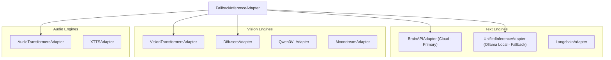

# Technical & Modular Architecture (Atomic & Hexagonal)

This document describes the software architecture of the **Double_scenario_Project** (Anime Archetype Engine). The project adopts an **Atomic & Hexagonal** (Clean Architecture) approach to guarantee a strict decoupling between the business logic (Domain) and the infrastructure layer (Adapters).

---

## 1. Overview of the Hexagon

The architecture is divided into three distinct layers:

```mermaid
graph TD
    subgraph Frameworks & Adapters (External)
        Django[Django Backend & Channels]
        ML_Adapters[Inference Adapters: LocalLlama, Diffusers, Transformers]
        Persistence_Adapters[Persistence Adapters: Vertex AI, pgvector, Neo4j, Django DB]
    end

    subgraph Ports (Interfaces)
        InferencePort[InferencePort - includes Reranking]
        PersistencePort[PersistencePort - UnifiedRepository]
    end

    subgraph Core Domain (Business Logic)
        Services[Domain Services: AgenticRAGService, PromptManager, Games]
        Models[Pydantic Models: DTOs, AI Schemas]
    end

    Django --> Services
    Services --> InferencePort
    Services --> PersistencePort
    ML_Adapters --> InferencePort
    Persistence_Adapters --> PersistencePort
```

---

## 2. Source Code Structure

The backend code is organized under `backend/`:

- **`core/ports/`**: Abstractions (Abstract Base Classes) defining the business contracts.
  - `InferencePort`: Text/Image generation, voice cloning, reranking, and advanced computer vision.
  - `MlopsPort`: Handles telemetry, DPO logging, and AI feedback loops via Celery/GCP Tasks.
  - `PersistencePort`: Unified data access definition (`UnifiedRepositoryAdapter`).
- **`core/domain/services/`**: Pure business logic services, completely independent of infrastructure or frameworks.
- **`adapters/`**: Concrete infrastructure implementations.
  - `adapters/persistence/`: Handles data multi-sources (Vertex AI, pgvector, Neo4j, Django DB).
  - `adapters/inference/`: Adapter implementations for Google GenAI, BrainAPI, Ollama (Unified), and local Transformers.
- **`api/`**: Headless Django configuration. Dependencies are declared and injected via `containers/` (Dependency-Injector).

---

## 3. Storage & Persistence

The project utilizes **Vertex AI Vector Search (Collections)** in production and **pgvector (PostgreSQL)** / **NumPy (SQLite)** as local fallbacks for semantic vector searches. Data access is unified under the `UnifiedRepositoryAdapter`. Additionally, **Neo4j** acts as the graph database mapping complex, topological creator-studio-character relations.

---

## 4. Lazy Imports Strategy

To optimize startup performance and keep memory usage low, heavy AI libraries (`torch`, `transformers`, etc.) are imported lazily using an attribute-based wrapper (`lazy_import.py`). The actual module import is only triggered during the first attribute access, eliminating unnecessary loading overhead for non-AI tasks.

---

## 5. Extensibility & Port Implementation

Adapters implement the abstract ports. Any method not implemented by a specific adapter raises an `InferenceNotImplementedError`. Extending the platform follows a strict pattern:
1. Extend the abstract **Port** definition.
2. Implement the concrete logic in the corresponding **Adapter**.
3. Register or bind the new implementation inside `containers.py`.

---

## 6. Deployment: Decoupled Single Page Application (SPA)

Animetix is designed and deployed as a fully decoupled **Pure SPA** (Single Page Application).

- **Frontend (Static)**: A modern React application built with **Vite** (`frontend/`). The production bundle (`dist/`) is built for high performance. In development mode, Vite runs on port `5173` and proxies `/api` and `/ws` requests to the Django backend.
- **Backend (Headless API)**: Django operates strictly as a headless API. All legacy HTML templates and view controllers have been completely removed.
- **Unified Client-Side Routing**: Django routes any non-API fallback paths (`re_path(r'^(?!api/|static/|admin/).*$', spa_view)`) directly to the SPA, allowing React Router DOM to manage application routing on the client side.

### Streamlined Flows & Decoupling
1. **Communication**: Clean JSON REST API exposed under `/api/v1/`.
2. **State Management**: Frontend state is managed by lightweight **Zustand** stores, delegating game loops and decision rules to backend **Domain Services** under `backend/core/domain/services/`.
3. **Security & Authentication**: Managed user authentication relies on the React SPA token state, validated via the custom `GoogleIdentityAuthentication` JWT verifier.
4. **Production Configuration**:
   - Build the frontend bundle using `npm run build` within `frontend/`.
   - Serve static assets under `dist/` using Nginx or an CDN.
   - Configure a reverse proxy to route `/api/` and WebSockets `/ws/` traffic to the Django ASGI runner (Daphne/Uvicorn).

---

## 7. Inference Adapters Ecosystem

The project implements a resilient `FallbackInferenceAdapter` that manages fallback paths across multiple inference backends:



The `FallbackInferenceAdapter` probes available engines at boot and constructs a capacity map to dynamically route requests to the first functional adapter.

---

## 8. VisionTransformersAdapter Mixin Architecture

To maintain high readability and avoid a monolithic file, the `VisionTransformersAdapter` is modularized into **four specialized mixins**:


---

## 9. Error Hierarchy

All custom application errors derive from `AnimetixBaseError`:

```mermaid
classDiagram
    class AnimetixBaseError {
        +message: str
        +context: dict
    }
    class DomainError
    class InfrastructureError
    class InferenceError
    class InferenceTimeoutError
    class SpatialComputingError
    class MangaProcessingError
    class VideoProcessingError
    class ImageGenerationError
    class AdapterLoadError
    class ContentModerationError
    class KnowledgeGraphQueryError
    
    AnimetixBaseError <|-- InfrastructureError --|> AdapterLoadError
    AnimetixBaseError <|-- InfrastructureError --|> ContentModerationError
    AnimetixBaseError <|-- InfrastructureError --|> KnowledgeGraphQueryError
```

---

## 10. Access & Deployment Environments

### A. Local Development Environment
The frontend and backend run in isolation to support Hot Module Replacement (HMR).

- **Backend (Django)**: 
  - URL: `http://localhost:8000`
  - Command: `python backend/api/manage.py runserver`
- **Frontend (Vite / React)**: 
  - URL: `http://localhost:5173`
  - Command: `cd frontend && npm run dev`
  - *Note*: Vite automatically proxies `/api/*` and `/ws/*` calls to the Django instance.

### B. Dev / Staging Environment (Docker)
Containers package the entire infrastructure stack, serving the pre-built React frontend directly from the Django static server.

- **Standard Docker**:
  - URL: `http://localhost:8000`
  - Command: `docker-compose -f deploy/docker-compose.yml up`
- **Staging Docker** (includes debugging & experimental feature flags):
  - URL: `http://localhost:8080`
  - Command: `docker-compose -f deploy/docker-compose.yml -f deploy/docker-compose.staging.yml up`

### C. Production Environment (Hugging Face)
Animetix is optimized for container deployments on **Hugging Face Spaces**.

- **URL**: `https://huggingface.co/spaces/MissawB/Animetix`
- **Internal Port**: Container exposes port `7860`.
- **Pipeline**: Automated deployments triggered via GitHub Actions (`deploy_to_hf.yml`).
