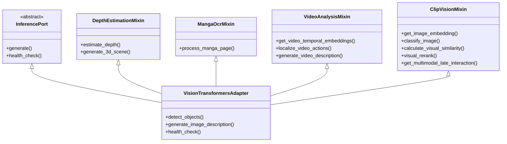

# Technical & Modular Architecture (Atomic & Hexagonal)

This document describes the software architecture of the **Double_scenario_Project** (Anime Archetype Engine). The project adopts an **Atomic & Hexagonal** (Clean Architecture) approach to guarantee a strict decoupling between the business logic (Domain) and the infrastructure layer (Adapters).

---

## 1. Overview of the Hexagon

The architecture is divided into three distinct layers:

```mermaid
graph TD
    subgraph Frameworks & Adapters (External)
        Django[Django Backend & Channels]
        ML_Adapters[Inference Adapters: LocalLlama, Diffusers, Transformers]
        Persistence_Adapters[Persistence Adapters: Vertex AI, pgvector, Neo4j, Django DB]
    end

    subgraph Ports (Interfaces)
        InferencePort[InferencePort - includes Reranking]
        PersistencePort[PersistencePort - UnifiedRepository]
    end

    subgraph Core Domain (Business Logic)
        Services[Domain Services: AgenticRAGService, PromptManager, Games]
        Models[Pydantic Models: DTOs, AI Schemas]
    end

    Django --> Services
    Services --> InferencePort
    Services --> PersistencePort
    ML_Adapters --> InferencePort
    Persistence_Adapters --> PersistencePort
```

---

## 2. Source Code Structure

The backend code is organized under `backend/`:

- **`core/ports/`**: Abstractions (Abstract Base Classes) defining the business contracts.
  - `InferencePort`: Text/Image generation, voice cloning, reranking, and advanced computer vision.
  - `MlopsPort`: Handles telemetry, DPO logging, and AI feedback loops via Celery/GCP Tasks.
  - `PersistencePort`: Unified data access definition (`UnifiedRepositoryAdapter`).
- **`core/domain/services/`**: Pure business logic services, completely independent of infrastructure or frameworks.
- **`adapters/`**: Concrete infrastructure implementations.
  - `adapters/persistence/`: Handles data multi-sources (Vertex AI, pgvector, Neo4j, Django DB).
  - `adapters/inference/`: Adapter implementations for Google GenAI, BrainAPI, Ollama (Unified), and local Transformers.
- **`api/`**: Headless Django configuration. Dependencies are declared and injected via `containers/` (Dependency-Injector).

---

## 3. Storage & Persistence

The project utilizes **Vertex AI Vector Search (Collections)** in production and **pgvector (PostgreSQL)** / **NumPy (SQLite)** as local fallbacks for semantic vector searches. Data access is unified under the `UnifiedRepositoryAdapter`. Additionally, **Neo4j** acts as the graph database mapping complex, topological creator-studio-character relations.

---

## 4. Lazy Imports Strategy

To optimize startup performance and keep memory usage low, heavy AI libraries (`torch`, `transformers`, etc.) are imported lazily using an attribute-based wrapper (`lazy_import.py`). The actual module import is only triggered during the first attribute access, eliminating unnecessary loading overhead for non-AI tasks.

---

## 4bis. Async / Sync Strategy

The codebase is **synchronous by default**, with `async` deliberately confined to two edges. This is the canonical Django + Channels model — keep it; do **not** "async-ify" the core.

- **Core domain & DRF views are SYNC.** Domain services (`core/domain/services/`) expose synchronous public APIs (e.g. `ReasoningAgentService.solve_complex_query`, the RAG services, game logic). DRF request handling is sync. Inference adapters are sync.
- **Async edge #1 — ASGI / Channels consumers** (`api/animetix/consumers/`): WebSocket consumers are `async` because they run on the ASGI event loop (real-time duel, codemanga, notifications, Gemini Live…). This is the *only* place async is the default.
- **Async edge #2 — Multi-agent bus subsystem** (`multi_agent_bus`, `orchestrator_agent_service.execute_workflow`, `reasoning_agent_service._on_bus_message`): Redis pub/sub over `asyncio`. Its `async` methods run **only inside an async context** (the bus loop / a consumer). Note: this subsystem is currently *not wired to any HTTP/WS endpoint* (experimental) — its services expose sync entry points (`solve_complex_query`) for normal use, and the async methods are bus-internal.

**Boundary rules (to keep it coherent):**
1. Never call an `async` method directly from sync request code. If a sync view ever needs the bus, wrap with `asgiref.sync.async_to_sync` — do not spin up `asyncio.run()` per request (it breaks the running loop under ASGI). *(Current count of boundary crossings: zero — the edges don't leak into the core.)*
2. Never perform blocking I/O (DB, sync HTTP) directly inside an async consumer; wrap with `asgiref.sync.sync_to_async`.
3. If the multi-agent bus is ever exposed to users, drive it from an **async consumer**, not a sync DRF view.

For SSRF-safe HTTP, both sync (`safe_http_request`) and async (`safe_http_request_async`) helpers exist in `core/utils/security.py`; pick the one matching your context.

---

## 5. Extensibility & Port Implementation

Adapters implement the abstract ports. Any method not implemented by a specific adapter raises an `InferenceNotImplementedError`. Extending the platform follows a strict pattern:
1. Extend the abstract **Port** definition.
2. Implement the concrete logic in the corresponding **Adapter**.
3. Register or bind the new implementation inside `containers.py`.

---

## 6. Deployment: Decoupled Single Page Application (SPA)

Animetix is designed and deployed as a fully decoupled **Pure SPA** (Single Page Application).

- **Frontend (Static)**: A modern React application built with **Vite** (`frontend/`). The production bundle (`dist/`) is built for high performance. In development mode, Vite runs on port `5173` and proxies `/api` and `/ws` requests to the Django backend.
- **Backend (Headless API)**: Django operates strictly as a headless API. All legacy HTML templates and view controllers have been completely removed.
- **Unified Client-Side Routing**: Django routes any non-API fallback paths (`re_path(r'^(?!api/|static/|admin/).*$', spa_view)`) directly to the SPA, allowing React Router DOM to manage application routing on the client side.

---

## 7. Inference Adapters Ecosystem (Local-First Priority)

The project implements a resilient `FallbackInferenceAdapter` that prioritizes free local compute to minimize operational costs (maximizing margin).

```mermaid
graph TD
    FallbackAdapter["FallbackInferenceAdapter"]
    
    subgraph Local_Compute [Tier 1: Free (Priority)]
        Ollama["UnifiedInferenceAdapter (Ollama - API)"]
        Transformers["LocalTextAdapter (Transformers - 4bit)"]
    end

    subgraph Managed_Inference [Tier 2: Managed (Fallback)]
        BrainAPI["BrainAPIAdapter (Custom Central API)"]
    end
    
    subgraph External_APIs [Tier 3: Pay-Per-Token (Last Resort)]
        Gemini["GoogleGenAIAdapter (Gemini 1.5)"]
    end
    
    FallbackAdapter --> Ollama
    FallbackAdapter --> Transformers
    FallbackAdapter --> BrainAPI
    FallbackAdapter --> Gemini
```

---

## 8. Economy & Monetization: The Berrix Model

Animetix operates on a **Rewarded Economy** where all advanced AI features are 100% free for users, financed by their engagement.

### 8.1. Tokens: The Berrix (Bx)
- **Passive Mining**: Users earn +20 Bx every 3 minutes of gameplay (Blindtest, Akinetix, etc.).
- **Active Injection**: Users can watch 30s sponsored videos ("Rewarded Ads") for +250 Bx.
- **Micro-Transactions**: Direct purchase of Berrix packs via Stripe for power-users.

### 8.2. Token Consumption & Protection
Business logic services (`InferencePort`, `Forge`) call the atomic `deduct_berrix` function. If the user's `wallet_balance` is insufficient, the API returns an **HTTP 402 Payment Required** error, which the frontend intercepts to redirect the user to the **Power Station**.

---

## 9. VisionTransformersAdapter Mixin Architecture

To maintain high readability and avoid a monolithic file, the `VisionTransformersAdapter` is modularized into **four specialized mixins**:



---

## 10. Error Hierarchy

All custom application errors derive from `AnimetixBaseError`:

```mermaid
classDiagram
    class AnimetixBaseError {
        +message: str
        +context: dict
    }
    class DomainError
    class InfrastructureError
    class InferenceError
    class InferenceTimeoutError
    class SpatialComputingError
    class MangaProcessingError
    class VideoProcessingError
    class ImageGenerationError
    class AdapterLoadError
    class ContentModerationError
    class KnowledgeGraphQueryError
    
    AnimetixBaseError <|-- InfrastructureError --|> AdapterLoadError
    AnimetixBaseError <|-- InfrastructureError --|> ContentModerationError
    AnimetixBaseError <|-- InfrastructureError --|> KnowledgeGraphQueryError
```

---

## 11. Access & Deployment Environments

### A. Local Development Environment
The frontend and backend run in isolation to support Hot Module Replacement (HMR).

- **Backend (Django)**: 
  - URL: `http://localhost:8000`
  - Command: `python backend/api/manage.py runserver`
- **Frontend (Vite / React)**: 
  - URL: `http://localhost:5173`
  - Command: `cd frontend && npm run dev`
  - *Note*: Vite automatically proxies `/api/*` and `/ws/*` calls to the Django instance.

### B. Dev / Staging Environment (Docker)
Containers package the entire infrastructure stack, serving the pre-built React frontend directly from the Django static server.

- **Standard Docker**:
  - URL: `http://localhost:8000`
  - Command: `docker-compose -f deploy/docker-compose.yml up`
- **Staging Docker** (includes debugging & experimental feature flags):
  - URL: `http://localhost:8080`
  - Command: `docker-compose -f deploy/docker-compose.yml -f deploy/docker-compose.staging.yml up`

### C. Production Environment (Hugging Face)
Animetix is optimized for container deployments on **Hugging Face Spaces**.

- **URL**: `https://huggingface.co/spaces/MissawB/Animetix`
- **Internal Port**: Container exposes port `7860`.
- **Pipeline**: Automated deployments triggered via GitHub Actions (`deploy_to_hf.yml`).
