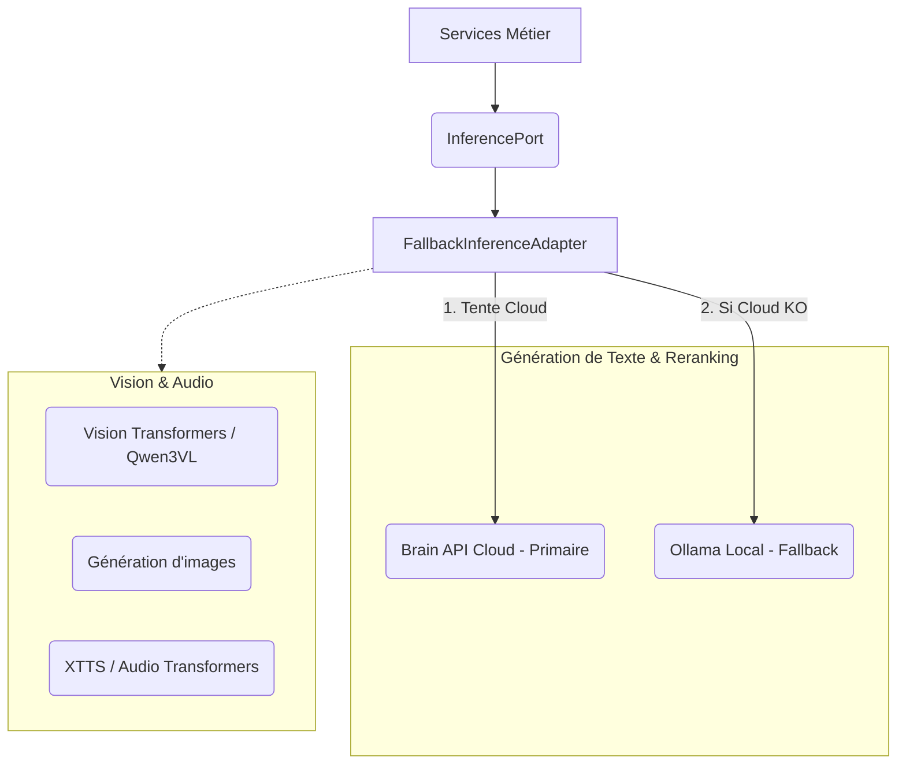
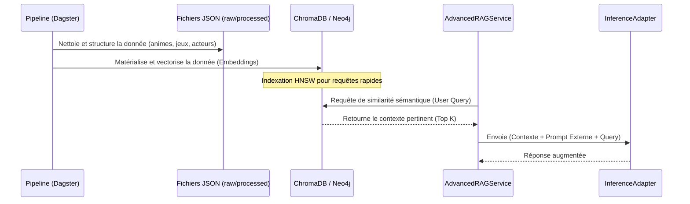
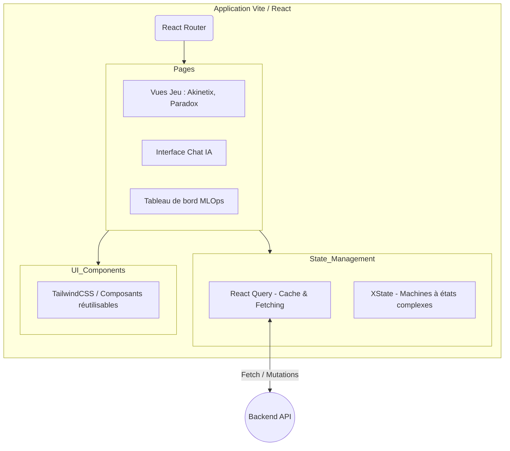

# Diagrammes d'Architecture - Double_scenario_Project (Animetix)

Ce document regroupe les schémas explicatifs de l'architecture du projet. Ils sont rédigés au format [Mermaid](https://mermaid.js.org/). Si vous utilisez un IDE compatible (VSCode avec l'extension Markdown Preview Mermaid Support, PyCharm, ou GitHub/GitLab), les schémas s'afficheront automatiquement. Vous pouvez également copier-coller ces blocs sur [Mermaid Live Editor](https://mermaid.live/).

---

## 1. Vue d'Ensemble : Découplage Global du Système

Ce schéma illustre la séparation stricte (Pure SPA) entre le client (React) et le serveur (API Django), ainsi que l'infrastructure de données.

```mermaid
graph LR
    %% Acteurs
    User((Utilisateur))

    %% Front-End (Client)
    subgraph Frontend ["Frontend (SPA React / Vite)"]
        UI[Interface Utilisateur]
        State[Gestion d'État (React Query / XState)]
        AuthUI[Gestion Auth UI]
    end

    %% Back-End (Serveur)
    subgraph Backend ["Backend Headless (Django / Hexagonal)"]
        API[API REST JSON]

        WS[WebSockets]
        Core[Core Domain (Logique Métier)]
    end

    %% Infrastructure de Données
    subgraph Infrastructure ["Persistance & Cache"]
        PostgreSQL[(PostgreSQL)]
        Redis[(Redis)]
        Neo4j[(Neo4j - Graph DB)]
        Chroma[(ChromaDB)]
    end

    %% Infrastructure IA
    subgraph AI_Ecosystem ["Écosystème IA"]
        LocalLLM[Modèles Locaux (Ollama)]
        CloudAPI[Brain API Cloud]
        Vision[Modèles Vision / Audio]
    end

    %% Flux de communication
    User <-->|HTTP / WS| UI
    UI --> State
    State <-->|Requêtes API| API

    State <-->|Temps Réel| WS
    
    API --> Core
    WS --> Core
    
    Core <--> Infrastructure
    Core <--> AI_Ecosystem
```

**Explication :**
L'utilisateur n'interagit qu'avec l'application React. Cette dernière communique avec Django via des requêtes JSON (REST) ou des flux en temps réel (WebSockets). Le backend Django n'a aucune interface graphique ; son seul rôle est d'exécuter la logique métier (le "Core") et de discuter avec les bases de données et les modèles d'Intelligence Artificielle.

---

## 2. L'Architecture Hexagonale du Backend (Clean Architecture)

Ce schéma détaille le composant "Backend" du schéma précédent. Il montre comment le projet protège sa logique métier des détails techniques (bases de données, frameworks web, modèles IA).

```mermaid
graph TD
    subgraph Adapters ["Adapteurs (Infrastructure - Extérieur)"]
        DjangoWeb[Django Views / DRF]

        ChromaAdapter[UnifiedRepositoryAdapter (ChromaDB)]
        LLMAdapter[FallbackInferenceAdapter]
    end

    subgraph Ports ["Ports (Interfaces/Contrats - Frontière)"]
        InferencePort(InferencePort)
        PersistencePort(PersistencePort)
    end

    subgraph Domain ["Core Domain (Logique Métier - Intérieur)"]
        Entities[Entités (Pydantic, Dataclasses)]
        Services[Services: RAG, Agents, Jeux]
        Prompts[PromptManager (YAML)]
    end

    %% Inbound / Driving (Ce qui pilote le domaine)
    DjangoWeb -->|Appelle| Services
    
    %% Outbound / Driven (Ce que le domaine pilote)
    Services -->|Définit le besoin| InferencePort
    Services -->|Définit le besoin| PersistencePort
    
    %% Implémentations
    LLMAdapter -.->|Implémente| InferencePort
    ChromaAdapter -.->|Implémente| PersistencePort
```

**Explication :**
Le cœur du système (`Core Domain`) est isolé. Les services métier (qui gèrent les règles des jeux ou du RAG) ne savent pas s'ils parlent à PostgreSQL ou à une API Cloud. Ils utilisent des "Ports" (des interfaces abstraites). Les "Adapteurs" (comme Django, ChromaDB ou les modèles IA locaux) se branchent sur ces ports pour faire le pont avec le monde réel.

---

## 3. Focus sur le routage et le Fallback de l'IA (Inference)

Le projet intègre un système robuste pour ne jamais tomber en panne si un modèle d'IA échoue, grâce au `FallbackInferenceAdapter`.



**Explication :**
Quand l'application a besoin d'une IA (ex: pour discuter, générer une image, classer des résultats), elle demande au `FallbackInferenceAdapter`. Ce routeur intelligent évalue dynamiquement les adaptateurs disponibles. Pour le texte par exemple, il essaiera d'abord la Brain API Cloud (plus puissante), s'elle est indisponible ou trop lente, il basculera automatiquement sur une instance Ollama locale. 
---

## 4. Focus sur l' organisation de la donnée (Persistence & Pipeline MLOps)

Le système de persistance repose principalement sur la recherche vectorielle (pour faire du RAG - Retrieval-Augmented Generation) et est alimenté par un pipeline de données.



**Explication :**
1. En amont, un outil de Data Engineering (Dagster) traite des fichiers bruts pour les transformer en données propres et en "Vecteurs" (représentation mathématique du texte).
2. Ces vecteurs sont stockés dans ChromaDB et Neo4j.
3. Quand un utilisateur pose une question (via le RAG Service), la base de données cherche le contexte le plus proche.
4. Ce contexte est ajouté à la question et envoyé à l'IA pour garantir une réponse précise et basée sur vos données (et non sur les hallucinations de l'IA).

---

## 5. Zoom sur le Frontend (React SPA)



**Explication :**
Le frontend est conçu comme un logiciel à part entière. Le `React Router` distribue l'utilisateur vers les différentes pages (Chat, Jeux, Stats). Les états compliqués des jeux ou du cache serveur sont gérés respectivement par `XState` et `React Query`. La mise en forme utilise des composants atomiques stylisés avec `TailwindCSS`.
