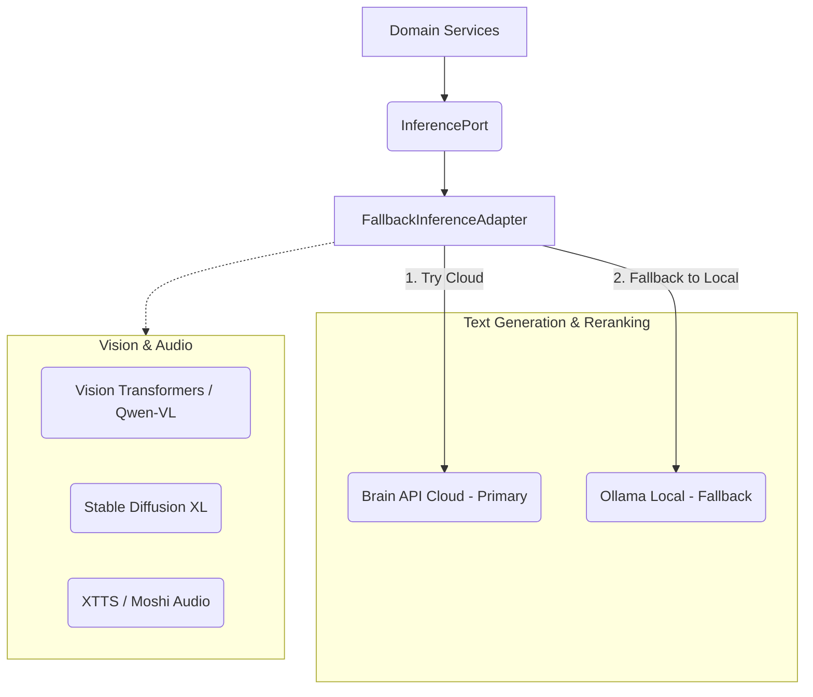
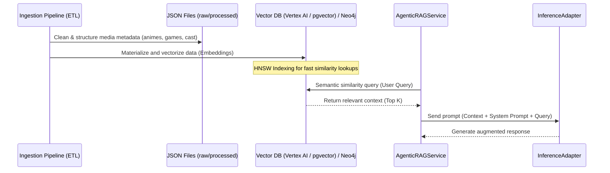
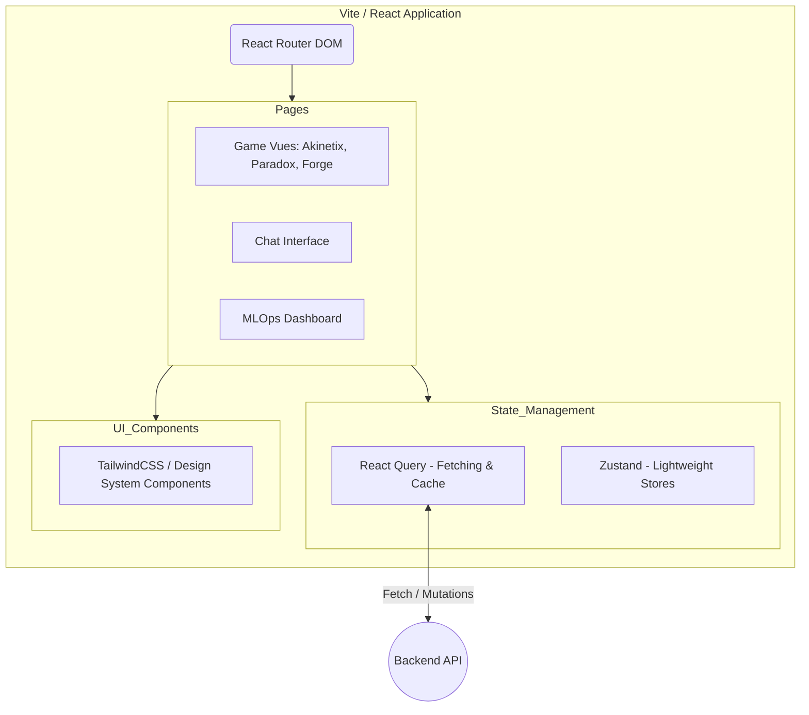

# Architecture Diagrams - Double_scenario_Project (Animetix)

This document groups the explanatory diagrams of the project's architecture. They are written in [Mermaid](https://mermaid.js.org/) format. If you use a compatible IDE (VSCode with Markdown Preview Mermaid Support extension, PyCharm, or GitHub/GitLab), the diagrams will render automatically. You can also copy-paste these blocks into the [Mermaid Live Editor](https://mermaid.live/).

---

## 1. Global Overview: System Decoupling

This diagram illustrates the strict decoupling (Pure SPA) between the client application (React) and the headless server (Django API), along with the data infrastructure.

```mermaid
graph LR
    %% Actors
    User((User))

    %% Frontend (Client)
    subgraph Frontend ["Frontend (React / Vite SPA)"]
        UI[User Interface]
        State[State Management (React Query / Zustand)]
        AuthUI[Auth State UI]
    end

    %% Backend (Server)
    subgraph Backend ["Backend (Django Headless / Hexagonal)"]
        API[JSON REST API]
        WS[WebSockets Channels]
        Core[Core Domain (Business Logic)]
    end

    %% Data Infrastructure
    subgraph Infrastructure ["Persistence & Cache"]
        PostgreSQL[(PostgreSQL / pgvector)]
        Redis[(Redis)]
        Neo4j[(Neo4j - Graph DB)]
        VertexAI[(Vertex AI Vector Search)]
    end

    %% AI Infrastructure
    subgraph AI_Ecosystem ["AI Ecosystem"]
        LocalLLM[Local Models (Ollama)]
        CloudAPI[Brain API / Google GenAI]
        Vision[Vision / Audio Models]
    end

    %% Communication Flows
    User <-->|HTTP / WS| UI
    UI --> State
    State <-->|API Requests| API
    State <-->|Real-time Events| WS
    
    API --> Core
    WS --> Core
    
    Core <--> Infrastructure
    Core <--> AI_Ecosystem
```

**Explanation:**
The user interacts exclusively with the React SPA. The client communicates with Django via JSON REST requests or real-time WebSockets. The Django backend is headless and contains no HTML templates; its role is solely executing business logic (the "Core") and communicating with data layers and AI engines.

---

## 2. Hexagonal Backend Architecture (Clean Architecture)

This diagram details the "Backend" component from the previous overview. It highlights how the project protects its core business logic from infrastructure dependencies (databases, web frameworks, external AI models).

```mermaid
graph TD
    subgraph Adapters ["Adapters (Infrastructure - External)"]
        DjangoWeb[Django Views / DRF]
        VectorAdapter[UnifiedRepositoryAdapter (Vertex AI / pgvector)]
        LLMAdapter[FallbackInferenceAdapter]
    end

    subgraph Ports ["Ports (Interfaces/Contracts - Boundaries)"]
        InferencePort(InferencePort)
        PersistencePort(PersistencePort)
    end

    subgraph Domain ["Core Domain (Business Logic - Internal)"]
        Entities[Entities (Pydantic Schemas)]
        Services[Domain Services: RAG, Agents, Games]
        Prompts[PromptManager (YAML)]
    end

    %% Inbound / Driving (What drives the domain)
    DjangoWeb -->|Calls| Services
    
    %% Outbound / Driven (What the domain drives)
    Services -->|Defines Need| InferencePort
    Services -->|Defines Need| PersistencePort
    
    %% Implementations
    LLMAdapter -.->|Implements| InferencePort
    VectorAdapter -.->|Implements| PersistencePort
```

**Explanation:**
The core of the system (`Core Domain`) is isolated. The business services (which manage game rules or RAG pipelines) have no direct knowledge of PostgreSQL, SQLite, or Google Cloud APIs. They depend on abstract "Ports". Concrete "Adapters" plug into these ports to route data to and from real infrastructure components.

---

## 3. Focus on AI Routing & Fallback (Inference)

The project integrates a robust fallback route manager (`FallbackInferenceAdapter`) to ensure the application remains operational even if specific cloud or local engines fail.



**Explanation:**
When the business layer requests an AI generation (e.g. Chat, Image synthesis, voice generation, or document reranking), it calls the `FallbackInferenceAdapter`. This adapter evaluates active engines. For text, it will try the cloud-based Brain API or Vertex AI first. If that request fails, it automatically fallbacks to a local Ollama instance without disrupting the user journey.

---

## 4. Data Flows & Ingestion (Persistence & ETL Pipeline)

The data persistence layers support semantic search (RAG - Retrieval-Augmented Generation) and are populated by scheduled ingestion jobs.



**Explanation:**
1. Upstream, scheduled ETL scripts clean raw files and generate semantic embeddings.
2. These vectors are indexed in Vertex AI Vector Search / pgvector and relations are mapped in Neo4j.
3. When a user queries the system (RAG Service), the databases identify the most semantically close metadata.
4. This retrieved context is injected into the prompt sent to the LLM, ensuring factual accuracy and mitigating hallucinations.

---

## 5. Frontend Composition (React SPA)



**Explanation:**
The frontend operates as a decoupled software application. The `React Router` routes users to different page containers. Complex state management (e.g. game loops and server caching) is managed respectively by `Zustand` stores and `React Query`. Layout styling is composed of atomic design components utility-styled via `TailwindCSS`.
