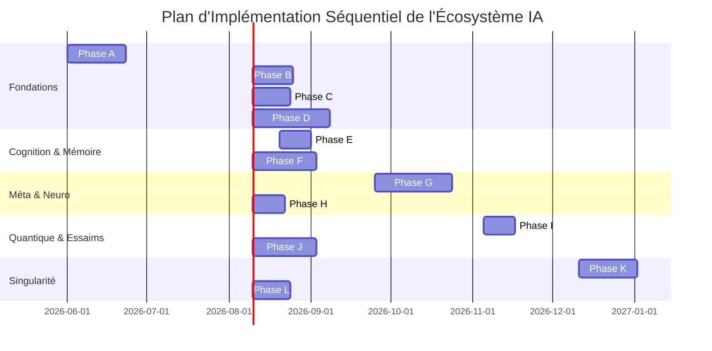

# 🗺️ Feuille de Route Globale de l'IA

Ce document formalise la planification stratégique et l'architecture technique des futures améliorations sémantiques, cognitives, immersives et évolutives de la plateforme **Animetix**. Ces modules seront implémentés de manière séquentielle pour garantir l'intégrité et la stabilité de l'écosystème, couvrant des innovations court terme jusqu'aux concepts de singularité technologique.

---

## 📅 Chronologie d'Intégration Globale

---

## 🛠️ Spécifications Techniques Détaillées

#### Phase A : RAG & Recherche Sémantique Avancée
*   **A.1 `LateInteractionColBERTAdapter`** : Recherche ultra-précise sur des micro-détails narratifs via un alignement de tokens fins (ColBERTv2) au lieu d'un encodage de phrase globale.
*   **A.2 `HierarchicalGraphRAGService`** : Exécute l'algorithme de détection de communautés Leiden sur Neo4j. Les LLMs Scout résument chaque communauté pour répondre à des requêtes holistiques complexes.

#### Phase B : Inférence & Raisonnement (Vitesse & Profondeur)
*   **B.1 Inférence Unifiée (Ollama)** : Optimisation de l'inférence locale via Ollama pour garantir des performances sub-secondes sur le matériel grand public.
*   **B.2 `DynamicBudgetTTCSelector`** : Optimisation de la latence par routage intelligent selon un "score d'ambiguïté", allouant ou non des tokens de réflexion `<thought>` (Test-Time Compute).

#### Phase C : Apprentissage & MLOps
*   **C.1 `AutomatedDPOLoopTrigger`** : Boucle autonome extrayant les feedbacks utilisateurs via Dagster pour lancer un entraînement DPO (Direct Preference Optimization) via LoRA et recharger le modèle à la volée.

#### Phase D : Immersion & Multimodalité
*   **D.1 `VideoLanguageIndexingService`** : Indexation sémantique d'ouvertures/fins d'animes via `Video-LLaVA`, vectorisée et liée au GraphRAG Neo4j.
*   **D.2 `StaticDiorama3DService`** : Génération de scènes 3D navigables depuis une image fixe grâce à *DepthAnything V2* et *Static Gaussian Splatting*.
*   **D.3 `CinematicVolumetricReconstructionService`** : Reconstitution d'environnements 3D dynamiques à partir de séquences animées 2D via flux optique et *Dynamic Cinematic Splatting*.

#### Phase E : Recherche Cognitive Arborescente
*   **E.1 `TreeOfThoughtsSearchService`** : Résolution de requêtes complexes via MCTS (Monte Carlo Tree Search), où un modèle génère des étapes de réflexion, un modèle critique les évalue, et les meilleures branches sont synthétisées.

#### Phase F : Mémoire Épisodique Graphique & Profilage Logique
*   **F.1 `EpisodicMemoryCompressor`** : Consolidation de la mémoire à long terme fusionnant la vectorisation (Chroma) et les graphes de relations (Neo4j) au niveau de l'entité `:User`.
*   **F.2 `NeuroSymbolicUserProfiler`** : Utilisation du solveur **Z3** pour déduire des règles logiques formelles des préférences utilisateurs, supprimant l'ambiguïté des filtres dans les requêtes RAG.

#### Phase G : Méta-Cognition & Théorie des Jeux
*   **G.1 `DSPyPromptOptimizer`** : Mutation sémantique et sélection naturelle des prompts en boucle fermée pour maximiser la pertinence (Auto-Tuning).
*   **G.2 `CounterfactualRegretMinimizationSolver`** : Moteur de théorie des jeux résolvant des jeux à information incomplète (ex: Akinetix) avec regret contrefactuel minimum (CFR) en s'entraînant contre lui-même.

#### Phase H : Neuromorphique & Traitement Continu
*   **H.1 `LiquidNeuralNetworkSimulator`** : Modélisation neuromorphique dynamique (LNN) simulant des équations différentielles pour traiter des flux continus (émotion vocale, attention temporelle).

#### Phase I : Modélisation Cognitive Quantique
*   **I.1 `QuantumCognitivePreferenceModel`** : Modélisation de l'état d'esprit de l'utilisateur sous forme de vecteur d'état complexe (Règle de Born), représentant les probabilités non-classiques et l'effet d'ordre des choix.

#### Phase J : Essaims Décentralisés & Simulation Contrefactuelle
*   **J.1 `SwarmConsensusOrchestrator`** : Réseau de micro-agents spécialisés votant sur la véracité historique ou sémantique via un protocole de consensus décentralisé (Multi-Agent Paxos).
*   **J.2 `CounterfactualConversationSimulator`** : Génération de timelines conversationnelles alternatives ("mondes possibles") calculant le regret sur des choix de dialogue alternatifs.

#### Phase K : Auto-Compilation Récursive & Plasticité Neuromorphique
*   **K.1 `SelfEvolvingCompiler`** : Auto-génération, compilation dynamique à la volée, et exécution de microcode C/Rust pour court-circuiter et optimiser les goulots d'étranglement de l'application sans interruption.
*   **K.2 `SynapticPlasticitySimulator`** : Poids sémantiques plastiques se mettant à jour en temps réel (règle de Hebb / STDP) selon l'intervalle temporel d'évocation des concepts par l'utilisateur.

#### Phase L : Synthèse de Multivers Originaux
*   **L.1 `AutonomousDomainSynthesizer`** : Génération d'univers fictifs complets (lois physiques, factions, chronologies). L'IA crée automatiquement de nouveaux nœuds dans Neo4j (:Character, :Media, :Genre) correspondants à des œuvres qui n'existent pas, avec leurs fiches complètes et résumés d'épisodes.
