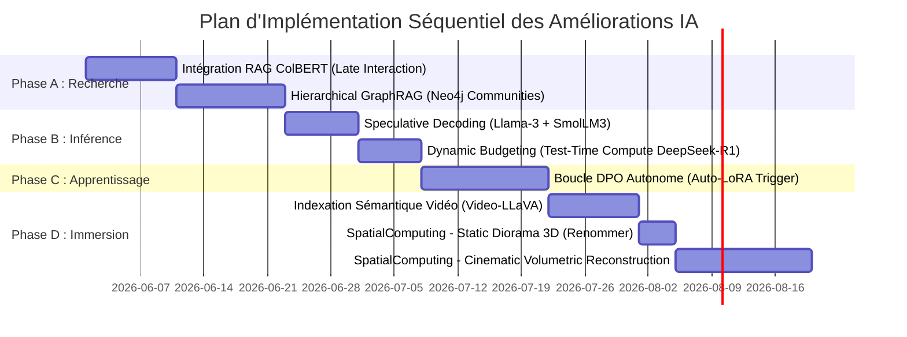

# 🗺️ Feuille de Route d'Amélioration de l'IA (SOTA 2026)

Ce document formalise la planification stratégique et l'architecture technique des futures améliorations sémantiques, cognitives, et immersives de la plateforme **Animetix**. Ces modules seront implémentés de manière séquentielle pour garantir l'intégrité et la stabilité de l'écosystème.

---

## 📅 Chronologie d'Intégration Séquentielle

---

## 🛠️ Spécifications Techniques Détaillées des Composants

### 1. Phase A : RAG & Recherche Sémantique Avancée

#### Composant A.1 : `LateInteractionColBERTAdapter` (Recherche fine)
*   **Objectif** : Remplacer l'encodage de phrase globale par un alignement de tokens fins.
*   **Fonctionnement** : 
    *   Utilise un modèle léger comme `colbert-ir/colbertv2.0`.
    *   Génère un tenseur de dimensions `(N_tokens, 128)` pour chaque document.
    *   Au moment de la recherche, calcule la somme des scores de similarité maximale (MaxSim) entre les jetons de la requête et ceux des documents.
*   **Impact** : Recherche ultra-précise sur des micro-détails narratifs.

#### Composant A.2 : `HierarchicalGraphRAGService` (Synthèse globale)
*   **Objectif** : Permettre des résumés de haut niveau à l'échelle de la base de données.
*   **Fonctionnement** :
    *   Exécute l'algorithme de détection de communautés **Leiden** sur Neo4j via `gds.leiden.write`.
    *   Chaque communauté (groupe de nœuds interconnectés) est résumée par un agent LLM Scout.
    *   Ces résumés sont stockés dans un index vectoriel hiérarchique.
*   **Impact** : Réponses immédiates aux requêtes holistiques (ex: "Quelle est l'évolution des codes du Cyberpunk des années 80 à nos jours ?").

---

### 2. Phase B : Inférence & Raisonnement (Vitesse & Profondeur)

#### Composant B.1 : `SpeculativeDecodingInferenceAdapter` (Accélération locale)
*   **Objectif** : Accélérer la vitesse de génération sur matériel grand public.
*   **Fonctionnement** :
    *   Un **modèle ébaucheur** ultra-léger (ex: `SmolLM3-1.7B`) génère spéculativement un bloc de $K$ tokens.
    *   Le **modèle vérificateur** (ex: `Llama-3-8B`) valide en un seul passage parallèle les $K$ tokens.
    *   Les tokens acceptés sont conservés, les rejetés sont régénérés par le vérificateur.
*   **Impact** : Latence divisée par 2,5 sans aucune dégradation de la qualité des réponses.

#### Composant B.2 : `DynamicBudgetTTCSelector` (Routage intelligent)
*   **Objectif** : Optimiser la latence en limitant le temps de réflexion aux questions complexes.
*   **Fonctionnement** :
    *   L'analyseur de complexité évalue le prompt utilisateur et affecte un "score d'ambiguïté".
    *   Routage dynamique :
        *   *Score < 3* : Inférence directe sans tokens `<thought>`.
        *   *Score 3-7* : Activation de `DeepSeek-R1-Distill-8B` avec un budget maximum de 150 tokens de pensée.
        *   *Score > 7* : Activation de `DeepSeek-R1-Distill-8B` sans limite de réflexion.

---

### 3. Phase C : Apprentissage & MLOps

#### Composant C.1 : `AutomatedDPOLoopTrigger` (Auto-Amélioration)
*   **Objectif** : Permettre à l'IA d'apprendre des retours utilisateurs en totale autonomie.
*   **Fonctionnement** :
    *   Un capteur (sensor) Dagster surveille la table SQLite des feedbacks utilisateurs.
    *   Dès que 500 couples de réponses comparatives (Choisie/Rejetée) sont validés, un job Dagster extrait le dataset en JSONL.
    *   Lance un entraînement LoRA avec la bibliothèque `TRL` (Direct Preference Optimization).
    *   Le nouvel adaptateur est automatiquement rechargé par injection de dépendances.

---

### 4. Phase D : Immersion & Multimodalité

#### Composant D.1 : `VideoLanguageIndexingService` (Recherche Visuelle Multimodale)
*   **Objectif** : Indexer la dimension temporelle et visuelle des animes.
*   **Fonctionnement** :
    *   Scrape les vidéos d'openings, endings, et scènes clés.
    *   Utilise `Video-LLaVA` pour générer des descriptions textuelles denses par intervalles de 5 secondes.
    *   Vectore ces descriptions et les lie aux nœuds `Media` correspondants dans Neo4j.

#### Composant D.2 : `StaticDiorama3DService` (Visualisation 3D Statique)
*   **Objectif** : Générer une scène volumétrique 3D navigable à partir d'une image fixe unique (ex: poster de La Forge).
*   **Fonctionnement** :
    *   *Technologie* : **DepthAnything V2** + **Static Gaussian Splatting (SGS)**.
    *   Prend une image unique 2D, estime la carte de profondeur pixel par pixel, puis projette les pixels sous forme de nuage de points 3D (diorama spatial).

#### Composant D.3 : `CinematicVolumetricReconstructionService` (Visualisation 3D Dynamique)
*   **Objectif** : Reconstruire des environnements cinématiques complets et interactifs en 3D à partir d'extraits vidéo 2D d'animes.
*   **Fonctionnement** :
    *   *Technologie* : **Dynamic Neural Radiance Fields (DyNeRF)** + **Dynamic Cinematic Splatting (DCS)**.
    *   Prend un extrait vidéo 2D (mouvements de caméra), estime les flux optiques et les correspondances de poses (SfM), puis entraîne un modèle volumétrique temporel dynamique.
    *   Génère un espace 3D complet où l'utilisateur peut se déplacer librement pendant que la scène animée s'exécute en 3D.
