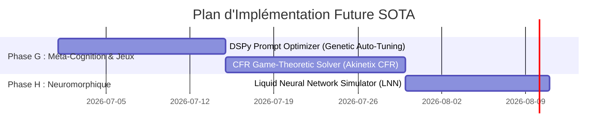

# 🚀 Feuille de Route Future SOTA (Horizons 2028-2030)

Ce document formalise la planification stratégique et les spécifications techniques de la troisième génération (Ultra-SOTA) d'améliorations pour **Animetix**, axée sur la méta-cognition auto-adaptative, la théorie des jeux et le traitement neuromorphique temporel.

---

## 📅 Chronologie d'Intégration Future SOTA

---

## 🛠️ Spécifications des Nouveaux Services

### 1. Phase G : Méta-Cognition & Théorie des Jeux

#### Service : `DSPyPromptOptimizer` ([dspy_prompt_optimizer.py](file:///C:/Users/bahma/PycharmProjects/Projet%20solo/Double_scenario_Project/src/core/domain/services/dspy_prompt_optimizer.py))
*   **Concept** : Optimisation automatique des prompts en boucle fermée via évaluation de pertinence (DSPy-like).
*   **Fonctionnement** :
    1.  *Mutation sémantique* : Le LLM propose 3 variantes linguistiques d'un prompt d'origine.
    2.  *Évaluation* : Calcule la précision moyenne sur un dataset de référence.
    3.  *Sélection naturelle* : Conserve et déploie la variante ayant obtenu la meilleure note.

#### Service : `CounterfactualRegretMinimizationSolver` ([cfr_game_solver.py](file:///C:/Users/bahma/PycharmProjects/Projet%20solo/Double_scenario_Project/src/core/domain/services/cfr_game_solver.py))
*   **Concept** : Moteur de théorie des jeux résolvant Akinetix sous information incomplète avec regret contrefactuel minimum (CFR).
*   **Fonctionnement** :
    1.  Simule des milliers de parties d'Akinetix contre lui-même.
    2.  Met à jour une matrice de regrets pour minimiser les mauvais choix face au bluff ou au bruit.

---

### 2. Phase H : neuromorphique & Traitement Continu

#### Service : `LiquidNeuralNetworkSimulator` ([liquid_neural_network.py](file:///C:/Users/bahma/PycharmProjects/Projet%20solo/Double_scenario_Project/src/core/domain/services/liquid_neural_network.py))
*   **Concept** : Modélisation neuromorphique dynamique (LNN) à constantes de temps variables pour le traitement de signaux continus.
*   **Fonctionnement** :
    1.  Simule des nœuds d'équations différentielles régissant l'évolution temporelle de l'attention ou de l'émotion vocale.
