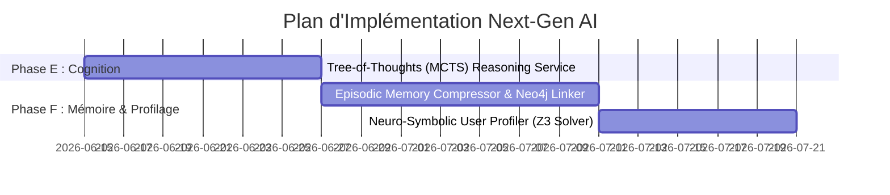

# 🚀 Feuille de Route Cognitive Next-Gen (Horizons SOTA 2027)

Ce document présente l'architecture et les spécifications techniques de la deuxième génération d'améliorations de l'IA pour **Animetix**, axée sur la cognition profonde, la mémoire épisodique relationnelle et le profilage logique neuro-symbolique.

---

## 📅 Chronologie d'Intégration Next-Gen

---

## 🛠️ Spécifications des Nouveaux Services

### 1. Phase E : Recherche Cognitive Arborescente

#### Service : `TreeOfThoughtsSearchService` ([tree_of_thoughts_service.py](file:///C:/Users/bahma/PycharmProjects/Projet%20solo/Double_scenario_Project/src/core/domain/services/tree_of_thoughts_service.py))
*   **Concept** : Résolution de requêtes complexes par exploration arborescente guidée par MCTS (Monte Carlo Tree Search).
*   **Fonctionnement** :
    1.  *Génération de branches* : Le LLM propose 3 étapes de pensée distinctes (nœuds).
    2.  *Évaluation (Critic)* : Un modèle critique local évalue la véracité et la pertinence de chaque nœud en attribuant une note (0.0 à 1.0).
    3.  *Sélection & Expansion* : Le nœud ayant la meilleure note est sélectionné pour l'étape suivante, tandis que les nœuds faibles sont élagués.
    4.  *Synthèse* : Compile le meilleur cheminement logique pour formuler la réponse finale.

---

### 2. Phase F : Mémoire Épisodique Graphique & Profilage Logique

#### Service : `EpisodicMemoryCompressor` ([episodic_memory_compressor.py](file:///C:/Users/bahma/PycharmProjects/Projet%20solo/Double_scenario_Project/src/core/domain/services/episodic_memory_compressor.py))
*   **Concept** : Consolidateur de mémoire à long terme fusionnant la recherche vectorielle (Chroma) avec les graphes de relations (Neo4j).
*   **Fonctionnement** :
    1.  *Compression* : Analyse les mémoires vectorielles existantes de l'utilisateur pour y détecter les redondances et en faire une synthèse unifiée.
    2.  *Lien Graphe* : Crée un nœud `:User` dans Neo4j lié aux nœuds de médias ou de genres par des relations de préférence précises (`:LIKES`, `:DISLIKES`, `:INTERESTED_IN`), enrichissant le GraphRAG au niveau utilisateur.

#### Service : `NeuroSymbolicUserProfiler` ([neuro_symbolic_user_profiler.py](file:///C:/Users/bahma/PycharmProjects/Projet%20solo/Double_scenario_Project/src/core/domain/services/neuro_symbolic_user_profiler.py))
*   **Concept** : Déducteur logique des règles de préférences utilisateurs à l'aide de Z3.
*   **Fonctionnement** :
    1.  Traduit les retours positifs et négatifs (AIFeedback) en contraintes logiques formelles.
    2.  Le solveur **Z3** résout ces contraintes pour déduire des règles de préférences valides sans aucune ambiguïté (ex: *"L'utilisateur n'aime pas le Nekketsu si l'œuvre comporte plus de 100 épisodes"*).
    3.  Ces règles sont converties en filtres appliqués systématiquement lors des futures recherches RAG.
