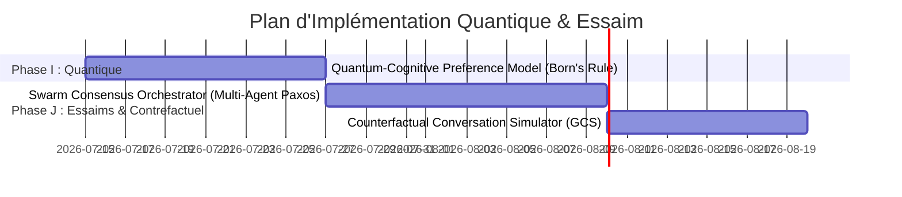

# 🌌 Feuille de Route Quantique & Essaim (SOTA 2030+)

Ce document présente l'architecture de la quatrième génération (Sci-Fi SOTA) d'améliorations de l'IA pour **Animetix**, axée sur la modélisation cognitive quantique, les essaims d'agents décentralisés et la simulation conversationnelle contrefactuelle.

---

## 📅 Chronologie d'Intégration Quantique & Essaim

---

## 🛠️ Spécifications des Nouveaux Services

### 1. Phase I : Modélisation Cognitive Quantique

#### Service : `QuantumCognitivePreferenceModel` ([quantum_cognitive_model.py](file:///C:/Users/bahma/PycharmProjects/Projet%20solo/Double_scenario_Project/src/core/domain/services/quantum_cognitive_model.py))
*   **Concept** : Représentation non-commutative des choix humains violant les probabilités classiques (effet d'ordre, interférences cognitives).
*   **Fonctionnement** :
    1.  *État Cognitif* : L'état d'esprit de l'utilisateur est modélisé sous forme d'un vecteur d'état complexe $|\psi\rangle$ (dans un espace de Hilbert).
    2.  *Mesure Quantique* : Poser une question équivaut à appliquer un opérateur de projection $P_a$.
    3.  *Règle de Born* : Calcule la probabilité de réponse via $p(a) = \langle\psi|P_a|\psi\rangle$.
    4.  *Effet d'Effondrement* : La réponse de l'utilisateur effondre son état cognitif vers le sous-espace propre associé, influençant de manière non-commutative la question suivante (effet d'ordre).

---

### 2. Phase J : Essaims Décentralisés & Simulation Contrefactuelle

#### Service : `SwarmConsensusOrchestrator` ([swarm_consensus.py](file:///C:/Users/bahma/PycharmProjects/Projet%20solo/Double_scenario_Project/src/core/domain/services/swarm_consensus.py))
*   **Concept** : Orchestrateur d'essaim d'agents spécialisés votant pour parvenir à un consensus sémantique décentralisé.
*   **Fonctionnement** :
    *   Fait communiquer 3 micro-agents (VisualExpert, AcousticExpert, LoreExpert) via un bus de messages.
    *   Applique un protocole de consensus décentralisé (type Raft/Paxos sémantique) où chaque agent propose des faits et vote sur leur véracité historique.

#### Service : `CounterfactualConversationSimulator` ([counterfactual_simulator.py](file:///C:/Users/bahma/PycharmProjects/Projet%20solo/Double_scenario_Project/src/core/domain/services/counterfactual_simulator.py))
*   **Concept** : Générateur de timelines conversationnelles alternatives (mondes possibles).
*   **Fonctionnement** :
    *   Prend une conversation réelle et simule ce qui se serait passé si l'IA ou l'utilisateur avait fait des choix de questions différents (exploration contrefactuelle).
    *   Calcule le regret contrefactuel conversationnel pour optimiser les futurs RAG.
