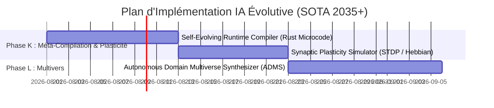

# 🌌 Feuille de Route de l'IA Évolutive & Auto-Synthèse (SOTA 2035+)

Ce document présente l'architecture de la cinquième génération (Singularité SOTA) d'améliorations pour **Animetix**, axée sur l'auto-compilation récursive de code, la plasticité synaptique neuromorphique en temps réel et la synthèse autonome de multivers originaux.

---

## 📅 Chronologie d'Intégration de l'IA Évolutive

---

## 🛠️ Spécifications des Nouveaux Services

### 1. Phase K : Auto-Compilation Récursive & Plasticité Neuromorphique

#### Service : `SelfEvolvingCompiler` ([self_evolving_compiler.py](file:///C:/Users/bahma/PycharmProjects/Projet%20solo/Double_scenario_Project/src/core/domain/services/self_evolving_compiler.py))
*   **Concept** : Génération et auto-compilation de microcode à la volée pour optimiser les performances de calcul des agents RAG.
*   **Fonctionnement** :
    1.  *Analyse du goulot d'étranglement* : Identifie les fonctions de recherche ou de calcul matriciel lentes.
    2.  *Génération Rust* : Rédige une extension native optimisée en Rust ou en C pour exécuter le calcul.
    3.  *Compilation & Liaison* : Compile dynamiquement le code généré et recharge la bibliothèque en mémoire sans arrêter l'application.

#### Service : `SynapticPlasticitySimulator` ([synaptic_plasticity.py](file:///C:/Users/bahma/PycharmProjects/Projet%20solo/Double_scenario_Project/src/core/domain/services/synaptic_plasticity.py))
*   **Concept** : Simulation d'apprentissage biologique en temps réel par plasticité synaptique (STDP - Spike-Timing-Dependent Plasticity).
*   **Fonctionnement** :
    1.  *Synapses Dynamiques* : Les connexions sémantiques entre concepts possèdent des poids plastiques changeant à chaque tour de parole.
    2.  *Règle d'Hebbi* : Met à jour les poids en fonction de l'intervalle temporel entre les activations neuronales ("cells that fire together, wire together").

---

### 2. Phase L : Synthèse de Multivers Originaux

#### Service : `AutonomousDomainSynthesizer` ([domain_synthesizer.py](file:///C:/Users/bahma/PycharmProjects/Projet%20solo/Double_scenario_Project/src/core/domain/services/domain_synthesizer.py))
*   **Concept** : Générateur infini de mondes, de scénarios et d'animes originaux personnalisés pour l'utilisateur.
*   **Fonctionnement** :
    1.  *Génération d'Univers* : Conçoit des cosmologies, des lois physiques et des factions pour un multivers original.
    2.  *Lien Graphe* : Génère et connecte les nœuds (:Character, :Media, :Studio, :Genre) de ce multivers fictif directement dans Neo4j.
    3.  *Chronologie narrative* : Écrit les résumés d'épisodes et les fiches personnages de cette œuvre fictive.
