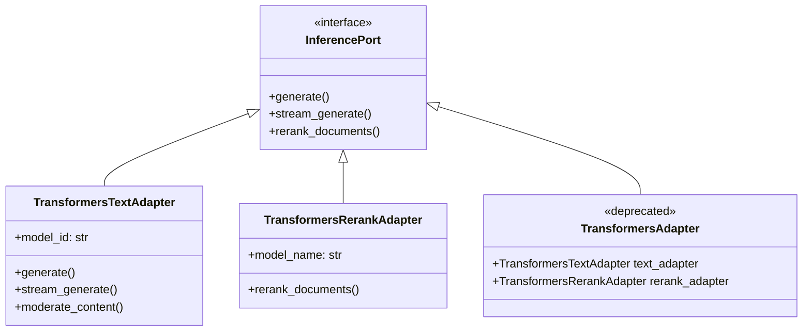

# 🎯 Spécification Technique : Déconstruction de TransformersAdapter (SRP Violation Refactoring)

- **Date :** 2026-05-26
- **Auteur :** Antigravity
- **Statut :** Approuvé
- **Composants ciblés :** `TransformersAdapter` ([transformers_adapter.py](file:///C:/Users/bahma/PycharmProjects/Projet%20solo/Double_scenario_Project/backend/adapters/inference/transformers_adapter.py)), `Container` ([containers.py](file:///C:/Users/bahma/PycharmProjects/Projet%20solo/Double_scenario_Project/backend/api/animetix/containers.py))

---

## 📌 1. Contexte & Problématique
La classe `TransformersAdapter` viole le principe de responsabilité unique (Single Responsibility Principle - SRP). Elle héberge en effet deux rôles sémantiques et techniques totalement distincts :
1. **Modèle de Langage causal local (Text Generation) :** Chargement d'un LLM volumineux de 1,5 milliard de paramètres (`Qwen/Qwen2.5-1.5B-Instruct`) en quantification 4-bit avec bitsandbytes.
2. **Scoring Cross-Encoder (Reranker) :** Chargement d'un modèle d'encodage croisé léger (`ms-marco-MiniLM-L-6-v2`) via `sentence_transformers` ou requête à l'API payante externe de Cohere.

Cette cohabitation au sein du même adaptateur entraîne des goulots d'étranglement de mémoire GPU, des instabilités lors des tests unitaires et des importations circulaires ou paresseuses non sécurisées.

---

## 🏗️ 2. Architecture Rénovée (SRP Compliant)

Nous séparons proprement l'adaptateur en deux classes distinctes héritant d' `InferencePort` :



### 2.1 `TransformersTextAdapter`
Dédié uniquement aux tâches textuelles génératives locales :
- **Fichier :** `backend/adapters/inference/transformers_text_adapter.py`
- **Méthodes :** `generate`, `stream_generate`, `moderate_content`, `health_check`.

### 2.2 `TransformersRerankAdapter`
Dédié uniquement à la sélection sémantique et au classement :
- **Fichier :** `backend/adapters/inference/transformers_rerank_adapter.py`
- **Méthodes :** `rerank_documents`, `health_check`.

### 2.3 Rétro-compatibilité (`TransformersAdapter`)
Le fichier d'origine `backend/adapters/inference/transformers_adapter.py` est maintenu pour la compatibilité avec les anciens tests unitaires. Il hérite de `TransformersTextAdapter` et délègue `rerank_documents` à `TransformersRerankAdapter`.

---

## 🧪 3. Plan de Vérification

### 3.1 Tests Unitaires & d'Intégration
1. **Validation unitaire :** Écriture de tests s'assurant que `TransformersTextAdapter` et `TransformersRerankAdapter` s'instancient et s'exécutent de manière totalement isolée.
2. **Correction des tests existants :**
   - Mise à jour de `test_video_rag.py` pour importer et patcher `VisionTransformersAdapter` (qui est le véritable moteur VLM supportant le traitement de frames vidéo, résolvant ainsi le crash d'AttributeError sur `_load_video_vlm`).
   - Mise à jour de `test_visual_reranker.py` pour importer et tester `VisionTransformersAdapter` (le véritable moteur de reranking visuel).
3. **Exécution pytest :**
   ```powershell
   pytest tests/adapters/ -v
   ```
