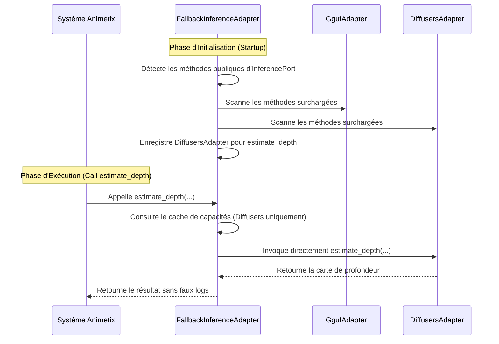

# 🎯 Spécification Technique : Détection Dynamique des Capacités & Routage Intelligent de l'Inférence

- **Date :** 2026-05-26
- **Statut :** Approuvé par l'utilisateur
- **Auteur :** Antigravity
- **Composants ciblés :** `FallbackInferenceAdapter` ([fallback_adapter.py](file:///C:/Users/bahma/PycharmProjects/Projet%20solo/Double_scenario_Project/backend/adapters/inference/fallback_adapter.py)), `Container` ([containers.py](file:///C:/Users/bahma/PycharmProjects/Projet%20solo/Double_scenario_Project/backend/api/animetix/containers.py))

---

## 📌 1. Contexte & Problématique
Le `FallbackInferenceAdapter` orchestre une liste d'adaptateurs d'inférence (génériques et spécialisés). Cependant, l'implémentation actuelle présente deux défauts majeurs :
1. **Dette de Performance (Routage inefficace) :** Lors de l'appel à une méthode hautement spécialisée (ex: `estimate_depth`, `clone_voice`), l'adaptateur tente séquentiellement d'exécuter la méthode sur chaque moteur de sa liste plate. Les moteurs génériques ne supportant pas cette méthode lèvent `InferenceNotImplementedError` un par un, provoquant une surcharge de latence évitable.
2. **Dette d'Observabilité (Logs pollués) :** Ces levées normales de non-implémentation sont attrapées comme des plantages standard (`CRASH`). Elles écrivent des messages `logger.error` dans la console et notifient l' `ObservabilityService` comme des échecs de production, faussant les alertes de santé.

---

## 🏗️ 2. Architecture Proposée (Introspection Dynamique)

Nous résolvons ces problèmes en introduisant un mécanisme d'**introspection de capacités** à l'initialisation de l'adaptateur.



### 2.1 Détection Dynamique des Méthodes Surchargées
À l'aide des attributs magiques `__func__` des méthodes d'instance liées, nous pouvons comparer la fonction implémentée par l'adaptateur à celle définie par défaut dans la classe de base `InferencePort` :

```python
def _is_method_overridden(self, adapter: InferencePort, method_name: str) -> bool:
    method = getattr(adapter, method_name, None)
    if method is None or not callable(method):
        return False
        
    port_method = getattr(InferencePort, method_name, None)
    if port_method is None:
        return True # Méthode personnalisée
        
    adapter_func = getattr(method, "__func__", method)
    port_func = getattr(port_method, "__func__", port_method)
    
    return adapter_func is not port_func
```

### 2.2 Table de Capacités
Au démarrage, nous parcourons toutes les méthodes de `InferencePort` n'étant pas privées (ne commençant pas par `_`) ou spéciales (ne commençant pas par `__`). Pour chaque méthode, nous filtrons la liste des adaptateurs pour ne conserver que ceux qui la surchargent réellement :

```python
def _build_capability_cache(self) -> None:
    import inspect
    self._capability_cache = {}
    
    # Récupère toutes les méthodes publiques définies dans InferencePort
    port_methods = [
        name for name, val in inspect.getmembers(InferencePort, predicate=inspect.isfunction)
        if not name.startswith("_")
    ]
    
    for method_name in port_methods:
        capable = [
            adapter for adapter in self.adapters
            if self._is_method_overridden(adapter, method_name)
        ]
        self._capability_cache[method_name] = capable
        logger.debug(f"⚙️ [Fallback] Registered capable engines for '{method_name}': {[a.__class__.__name__ for a in capable]}")
```

### 2.3 Dispatcher Optimisé & Traitement Silencieux des Exceptions
Le mécanisme de routage des appels est mis à jour pour :
1. N'interroger que la liste des adaptateurs compatibles présente dans `_capability_cache`.
2. Ignorer silencieusement et passer au suivant sans log en cas d'exception `InferenceNotImplementedError` ou `NotImplementedError`.
3. Logguer en `logger.error` et remonter à l'observabilité uniquement les vrais plantages inattendus (ex: timeouts, défaillances CUDA).

---

## 🧪 3. Plan de Vérification

### Tests Unitaires Automatisés
Nous écrirons une suite de tests dans `tests/adapters/test_fallback_structured.py` pour valider :
1. **L'introspection :** S'assurer que le cache enregistre correctement `DiffusersAdapter` pour `estimate_depth` mais pas `UnifiedInferenceAdapter`.
2. **Le routage direct :** Vérifier qu'un appel à `estimate_depth` va directement à l'adaptateur capable sans interroger les moteurs intermédiaires.
3. **Le silence sémantique :** Simuler une levée de `InferenceNotImplementedError` et s'assurer qu'aucun log d'erreur n'est écrit ni remonté à l'observabilité.
4. **La résilience :** S'assurer qu'un crash de type timeout réseau est quant à lui bien loggué comme erreur et remonté à l'observabilité.
