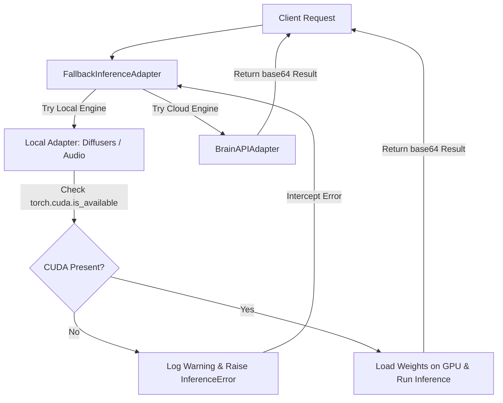

# Design Spec: Dynamic CUDA Detection & CPU Memory Guard

* **Date:** 2026-05-29
* **Author:** Antigravity
* **Status:** Approved

## 1. Introduction & Context

In the Animetix backend, local deep learning inference models are utilized for image generation (Stable Diffusion via `DiffusersAdapter`) and audio tasks (Voice Cloning, Soundscape Generation via `AudioTransformersAdapter`). 

### Problem Definition
When running on consumer machines without a compatible Nvidia GPU or CUDA drivers:
1. Loading these heavy neural networks on CPU can cause the system to run out of memory (OOM), leading to OS-level page faults and system crashes.
2. Even if loading succeeds, inference on CPU takes several minutes per step, rendering the interactive application completely unresponsive.
3. Silence/implicit fallbacks or crashes inside local adapters prevent the `FallbackInferenceAdapter` orchestrator from switching to the cloud/API-based engine (`BrainAPIAdapter`) dynamically.

### Objectives
* Prevent local deep learning initialization on CPU.
* Raise clear, diagnostic `InferenceError` exceptions early in the local model loading phase when CUDA is unavailable.
* Ensure the global `FallbackInferenceAdapter` successfully intercepts these errors and redirects queries to the cloud-based fallback seamlessly.
* Preserve local Pillow-based lightweight fallback for manga text bubble clearing, which runs efficiently on CPU.

---

## 2. Technical Architecture & Data Flow



### Components

#### 1. `DiffusersAdapter` Guard
* Methods to modify: `_load_txt2img`, `_load_img2img`, `_load_inpainting`.
* Check: `not torch.cuda.is_available()`.
* Action: Log a warning and raise `InferenceError` before loading weights from `from_pretrained`.

#### 2. `AudioTransformersAdapter` Guard
* Methods to modify: `_load_xtts`, `_load_audioldm`, `_load_moshi`.
* Check: `not torch.cuda.is_available()`.
* Action: Log a warning and raise `InferenceError` before downloading/initializing model pipelines.

---

## 3. Detailed Design

### A. DiffusersAdapter Guards
Inside `backend/adapters/inference/diffusers_adapter.py`:

```python
def _load_txt2img(self):
    if self.pipe: return
    if not torch.cuda.is_available():
        logger.warning("⚠️ GPU CUDA non détecté. Chargement local du modèle SDXL désactivé pour éviter un crash CPU/OOM.")
        raise InferenceError("CUDA GPU is not available. Local SDXL loading is disabled to prevent CPU memory crash.")
    ...
```

For inpainting, the guard in `_load_inpainting` will raise an `InferenceError`. This will be caught by the caller method `inpaint_text_bubbles`'s `try/except` block, transitioning to the local Pillow-only white bounding box removal method seamlessly.

### B. AudioTransformersAdapter Guards
Inside `backend/adapters/inference/audio_transformers_adapter.py`:

```python
def _load_xtts(self):
    if self._tts_model: return
    if not torch.cuda.is_available():
        logger.warning("⚠️ GPU CUDA non détecté. Chargement local des modèles audio désactivé pour éviter une surcharge CPU/OOM.")
        raise InferenceError("CUDA GPU is not available. Local audio models loading is disabled.")
    ...
```

---

## 4. Verification & Test Strategy

1. **Unit Testing**:
   * Create mock tests where `torch.cuda.is_available` is mocked to return `False`.
   * Verify that calling local adapters raises `InferenceError`.
   * Verify that the orchestrator `FallbackInferenceAdapter` handles the transition and delegates to `BrainAPIAdapter` successfully.
2. **Pristine Fallback Execution**:
   * Verify that `inpaint_text_bubbles` operates on the Pillow rendering fallback path without raising errors when CUDA is mocked as unavailable.
