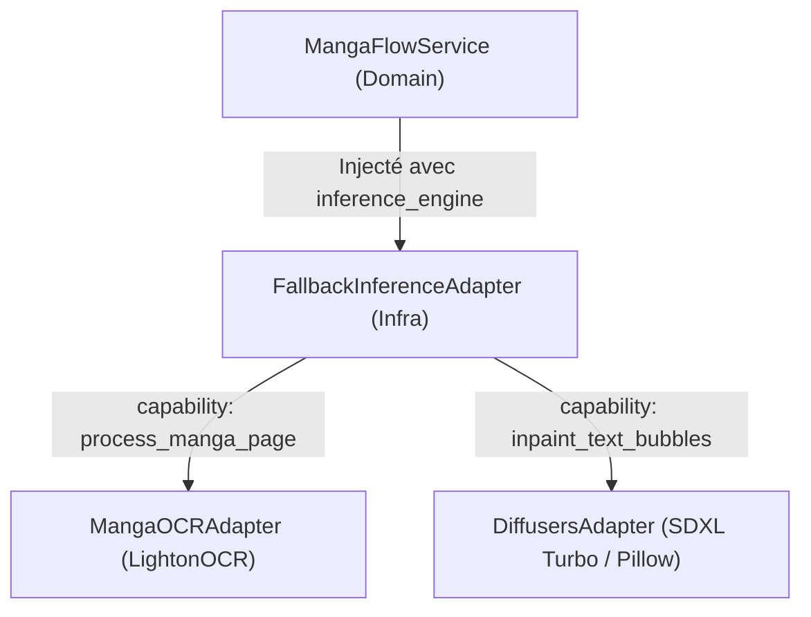

# 🎭 Spécification Technique - Chantier D : Traduction de Manga & Injection de Dépendances

Ce document spécifie l'architecture technique, le comportement d'inférence et la correction de la suite de tests pour la fonctionnalité de **Traduction de Manga** (Chantier D).

Conformément aux instructions finales de l'utilisateur, le système adoptera l'**Approche 1 (Fallback Algorithmique local via Pillow)**. Si le modèle de diffusion neuronal (SDXL-Turbo dans `DiffusersAdapter`) ne peut pas être chargé (ex: sur CPU sans CUDA / VRAM insuffisante), l'adaptateur basculera de manière transparente sur un traitement local instantané via la bibliothèque `PIL` (Pillow).

---

## 🏗️ 1. Architecture & Injection de Dépendances (DI)

### Le Problème Actuel
Le service de domaine `MangaFlowService` a besoin d'interroger à la fois un adaptateur d'OCR (`process_manga_page`) et un adaptateur d'inpainting visuel (`inpaint_text_bubbles`).
Actuellement, le conteneur injecte l'adaptateur spécialisé `inference.manga_ocr_adapter` qui ne supporte pas l'inpainting, provoquant des pannes directes.

### La Solution
Nous allons rediriger l'injection vers le moteur de repli centralisé **`inference.inference_engine`** (qui instancie `FallbackInferenceAdapter`).
Grâce au cache de capacités de `FallbackInferenceAdapter`, les appels seront automatiquement routés :
1.  `process_manga_page` -> Routé vers `MangaOCRAdapter`.
2.  `inpaint_text_bubbles` -> Routé vers `DiffusersAdapter` (local GPU/CPU) ou `BrainAPIAdapter` (Cloud).

---

## ⚙️ 2. Fallback Algorithmique local via Pillow (Approche 1)

Pour garantir une robustesse à 100% sans exiger de GPU, `DiffusersAdapter` implémentera un repli instantané en cas d'indisponibilité du modèle SDXL.

### Algorithme de Fallback dans `DiffusersAdapter` :
Si `self._inpaint_pipe` est indisponible ou non chargé :
1.  **Ouverture de l'image** : Charger l'image initiale `init_image` via `PIL.Image.open` en mode `RGB`.
2.  **Dessin des masques blancs** :
    Pour chaque bulle détectée dans `bubbles` (qui contient la `bbox` `[x1, y1, x2, y2]`) :
    *   Dessiner un rectangle blanc opaque (`fill="white"`) ou une ellipse sur ces coordonnées pour masquer l'ancien texte japonais/anglais.
3.  **Dessin du texte traduit** :
    *   Charger la police par défaut (Arial ou police système par défaut).
    *   Calculer la boîte englobante du nouveau texte (`textbbox`) pour le centrer parfaitement dans les coordonnées de la bulle (`bbox`).
    *   Dessiner le texte traduit en noir (`fill="black"`).
4.  **Retour base64** : Enregistrer l'image au format JPEG et la renvoyer sous forme de chaîne base64 formatée : `data:image/jpeg;base64,...`.

Cette approche garantit un temps d'exécution en millisecondes et une robustesse totale, quel que soit l'environnement.

---

## 🧪 3. Correction & Stabilisation de la Suite de Tests

Plusieurs tests d'intégration Manga et Fallback échouent en raison de cibles de mocks obsolètes (`src.adapters...` au lieu d'importations relatives ou directes sans `src`).

### Fichiers à modifier :
1.  **`tests/core/test_manga_ocr_adapter.py`** :
    *   Remplacer `with patch('src.adapters.inference.manga_ocr_adapter.pipeline'):` par **`with patch('adapters.inference.manga_ocr_adapter.pipeline'):`**.
2.  **`tests/adapters/test_fallback_structured.py`** :
    *   Remplacer `with patch("src.adapters.inference.fallback_adapter.logger.error") as mock_log_err:` par **`with patch("adapters.inference.fallback_adapter.logger.error") as mock_log_err:`**.

---

## 📝 4. Plan de Validation

*   **Validation DI** : Vérifier que le serveur charge et injecte `inference.inference_engine` dans `manga_flow_service`.
*   **Validation du Fallback Pillow** : Lancer la traduction manga dans un environnement sans GPU (ou en forçant `_inpaint_pipe = None`) et s'assurer qu'une image JPEG encodée en base64 valide contenant le texte français sur fond blanc est bien générée.
*   **Validation de la Suite de Tests** : Lancer `pytest` et s'assurer que les tests manga et fallback passent désormais à 100%.
