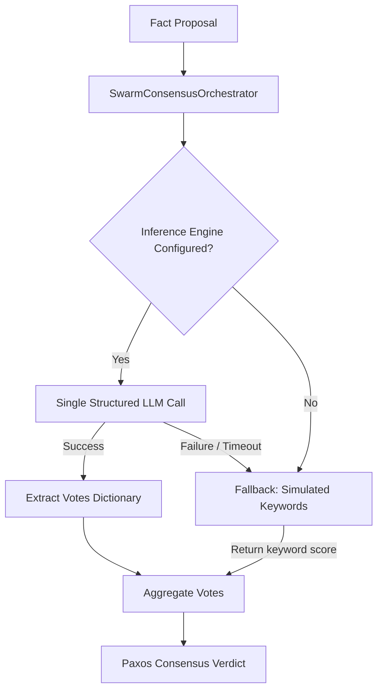

# Design Spec: Semantic Swarm Consensus (LLM Integration)

* **Date:** 2026-05-29
* **Author:** Antigravity
* **Status:** Approved

## 1. Introduction & Context

The `SwarmConsensusOrchestrator` in Animetix handles factual verification across multi-agent networks (Visual, Acoustic, and Lore experts) using a Paxos-style semantic voting consensus protocol.

### Problem Definition
Currently, the agents' votes are computed using simple, static keyword-matching lists inside `_simulate_agent_vote`. While extremely fast, this approach is not semantic:
1. It misses subtle synonyms or rich semantic facts that don't match the hardcoded keyword lists.
2. It fails to evaluate facts that require logical reasoning or deep Otaku/culture background knowledge.

### Objectives
* Connect the `SwarmConsensusOrchestrator` to a real `InferencePort` (LLM) when available.
* Minimize token usage and latency by performing a **single, unified LLM call** (Option B) that retrieves all agent votes simultaneously.
* Ensure a graceful fallback to the simulated keyword-matching heuristic if the LLM is not configured, or if the API call fails/times out, ensuring full compatibility with existing tests.

---

## 2. Technical Architecture & Data Flow



---

## 3. Detailed Design

### A. Pydantic Model for Structured Votes
We define a flexible, dynamic Pydantic model to parse the orchestrator's collective vote output:

```python
from pydantic import BaseModel, Field
from typing import Dict

class SwarmConsensusVotes(BaseModel):
    votes: Dict[str, float] = Field(
        ...,
        description="Dictionnaire mappant chaque nom d'agent à son score de confiance sémantique (entre 0.0 et 1.0)."
    )
```

### B. Single Call LLM Prompting
Within the orchestrator, we define `_get_swarm_votes_via_llm`:
1. **System Prompt**: Defines the roles of the three default experts (`VisualExpert`, `AcousticExpert`, `LoreExpert`).
2. **User Prompt**: Supplies the proposed fact and media title, requesting individual scores between 0.0 and 1.0.

```python
def _get_swarm_votes_via_llm(self, fact: str, media: str) -> Dict[str, float]:
    specialties = {
        "VisualExpert": "spécialisé dans les visuels, l'art, le dessin, l'animation et la cinématographie.",
        "AcousticExpert": "spécialisé dans la musique, les OST, les openings/endings, les voix et effets sonores.",
        "LoreExpert": "spécialisé dans le scénario, la mythologie, les personnages et la cohérence de l'univers."
    }
    
    system_prompt = (
        "Tu es l'Orchestrateur du Consensus d'Essaim (Swarm Consensus Orchestrator) d'Animetix.\n"
        "Ton rôle est de faire voter les micro-agents de l'essaim sur la véracité ou la pertinence d'un fait concernant un média (Anime/Manga).\n\n"
        "Voici la liste des agents votants et leur spécialité :\n"
        f"- VisualExpert : {specialties['VisualExpert']}\n"
        f"- AcousticExpert : {specialties['AcousticExpert']}\n"
        f"- LoreExpert : {specialties['LoreExpert']}\n\n"
        "Évalue le fait proposé et attribue à CHAQUE agent un score de confiance sémantique individuel entre 0.0 et 1.0 en fonction de sa spécialité.\n"
        "Réponds UNIQUEMENT au format JSON valide avec la clé 'votes' contenant le dictionnaire des scores."
    )
    
    prompt = (
        f"Média : {media}\n"
        f"Fait proposé : {fact}\n\n"
        "Évalue ce fait pour chaque expert. Quel est le dictionnaire des scores ?"
    )
    
    # Run structured generation via self.inference_engine
```

### C. Graceful Fallback Logics
If `self.inference_engine` is not set or throws any exception:
1. We capture the error with `logger.warning`.
2. We iterate over `self.agents` and populate the vote scores using `self._simulate_agent_vote(agent, fact, media_title)`.

---

## 4. Verification & Test Strategy

1. **Unit Testing**:
   * Add a new test in `tests/pipeline/test_quantum_swarm.py` called `test_swarm_consensus_llm_success`.
   * Mock `inference_engine.generate_structured` to return a `SwarmConsensusVotes` model with specific scores.
   * Verify that `SwarmConsensusOrchestrator` uses these scores and reaches consensus properly.
2. **Fallback Integration**:
   * Verify that the orchestrator gracefully switches back to keyword matching if the mocked inference engine raises an error.
