# Design Spec: Hermetic Multi-stage Frontend Build & Production Serving

## 1. Overview
The Animetix web service is an intelligent discovery engine that combines a Django REST backend and a React SPA frontend. Currently, in production (GCP Cloud Run), the server returns a static placeholder html `Animetix SPA Content` instead of the fully compiled React client. This is because the frontend static assets are ignored in `.gcloudignore` and not compiled inside the deployed container.

This document details the architecture, configuration, and implementation plan for building the React frontend directly within the Docker build pipeline (hermetic multi-stage build) and configuring Django to serve the React assets in production.

---

## 2. Goals & Success Criteria
* **Automated Compilation:** The React frontend must compile seamlessly during the GCP Cloud Build stage using Node.js without requiring local pre-compilation.
* **Production Serving:** Django must correctly serve the React SPA index template (`index.html`) on the French landing page `/fr/` (and all catch-all routes).
* **Asset Resolution:** Static assets (compiled JS chunks, CSS, icons, and web manifest) must resolve with a `200 OK` via Whitenoise.

---

## 3. Architecture & Components

### 3.1. Multi-Stage Dockerfile (`deploy/Dockerfile`)
The Dockerfile is updated to compile both assets and Python environments in isolated stages:

```mermaid
graph TD
    subgraph Stage 1: Frontend Builder
        NodeBase[node:20-alpine] --> CopyFront[Copy frontend/ folder]
        CopyFront --> npmInstall[npm ci or npm install]
        npmInstall --> npmBuild[npm run build]
        npmBuild --> OutDist[Output: frontend/dist/]
    end

    subgraph Stage 2: Backend Builder
        PyBase[python:3.11-slim] --> InstallDev[Install build-essential & libpq-dev]
        InstallDev --> venv[Create /opt/venv]
        venv --> pipInstall[pip install requirements.txt]
        pipInstall --> OutVenv[Output: /opt/venv/]
    end

    subgraph Stage 3: Runtime
        RunBase[python:3.11-slim] --> CopyVenv[Copy /opt/venv from Stage 2]
        CopyVenv --> CopyDist[Copy frontend/dist/ to /app/frontend/dist]
        CopyDist --> CopyCode[Copy backend code]
        CopyCode --> collectstatic[Run collectstatic]
        collectstatic --> supervisord[Launch Supervisord]
    end
```



### 3.2. Django Configuration (`backend/api/animetix_project/settings.py`)
To discover the React assets, the following settings will be defined:

1. **`TEMPLATES` Configuration:**
   Django will search for `index.html` in `/app/frontend/dist/`.
   ```python
   TEMPLATES = [
       {
           'BACKEND': 'django.template.backends.django.DjangoTemplates',
           'DIRS': [os.path.join(PROJECT_ROOT, "frontend", "dist")],
           'APP_DIRS': True,
           ...
       }
   ]
   ```

2. **`STATICFILES_DIRS` Configuration:**
   Django will discover the React compiled CSS/JS assets and serve them.
   ```python
   STATICFILES_DIRS = [
       os.path.join(PROJECT_ROOT, "frontend", "dist"),
   ]
   ```

---

## 4. Detailed Design & Code Changes

### 4.1. Refactored Dockerfile (`deploy/Dockerfile`)
```dockerfile
# Stage 1: Frontend Builder
FROM node:20-alpine AS frontend-builder
WORKDIR /app/frontend
COPY frontend/package*.json ./
RUN npm ci || npm install
COPY frontend/ ./
RUN npm run build

# Stage 2: Python Builder
FROM python:3.11-slim AS builder
ENV PYTHONDONTWRITEBYTECODE=1
ENV PYTHONUNBUFFERED=1
RUN apt-get update && apt-get install -y --no-install-recommends build-essential libpq-dev gcc libsndfile1 ffmpeg && rm -rf /var/lib/apt/lists/*
WORKDIR /app
RUN python -m venv /opt/venv
ENV PATH="/opt/venv/bin:$PATH"
COPY requirements.txt .
RUN pip install --no-cache-dir -r requirements.txt

# Stage 3: Runtime
FROM python:3.11-slim
RUN apt-get update && apt-get install -y --no-install-recommends libpq5 curl libsndfile1 ffmpeg && rm -rf /var/lib/apt/lists/*
RUN groupadd -r appuser && useradd -r -g appuser appuser
WORKDIR /app

# Copy environments
COPY --from=builder /opt/venv /opt/venv
COPY --from=frontend-builder /app/frontend/dist /app/frontend/dist
ENV PATH="/opt/venv/bin:$PATH"
ENV PYTHONPATH="/app:/app/backend:/app/backend/api:$PYTHONPATH"

# Copy code & set permissions
COPY --chown=appuser:appuser . .

# Run collectstatic to aggregate React and backend static files
RUN python backend/api/manage.py collectstatic --noinput

RUN mkdir -p data/raw data/processed data/models data/artifacts data/chroma_db && chown -R appuser:appuser /app
USER appuser
ENV DAGSTER_HOME=/app/backend/pipeline
EXPOSE 7860
CMD ["supervisord", "-c", "deploy/supervisord.conf"]
```

---

## 5. Verification Plan
* **Local Dry Run:** Verify the multi-stage build succeeds locally without error.
* **GCP Cloud Build:** Deploy using `gcloud builds submit` and verify successful compilation of both the React frontend and Python packages.
* **HTTP curl Verification:** Verify `/fr/` returns the complete React HTML index file instead of the empty placeholder.
