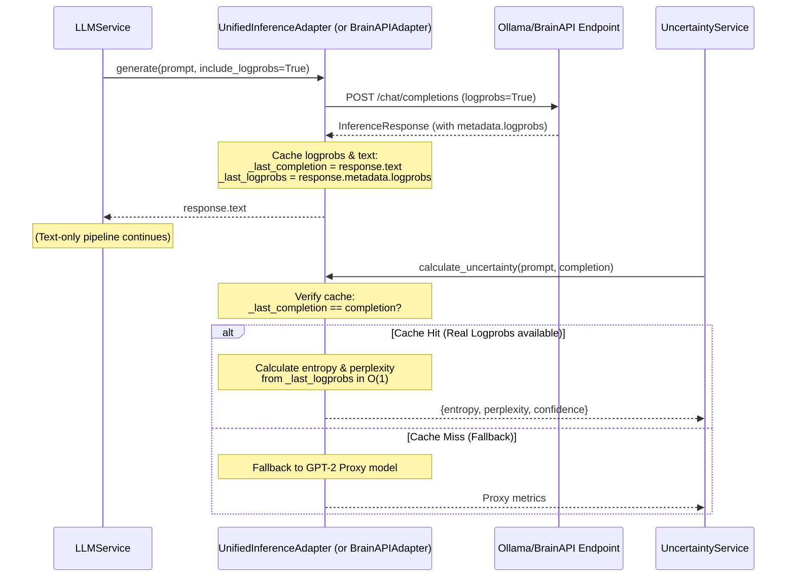

# Spécification Technique : Diagnostics & Incertitude Avancés via Logprobs Réels

Ce document spécifie le design et l'implémentation de la migration des calculs de quantification de l'incertitude (entropie, perplexité) vers une exploitation directe des `logprobs` réels renvoyés par les adaptateurs d'inférence (BrainAPI, Ollama), plutôt que de reposer sur un modèle d'évaluation local lourd comme proxy textuel.

## 1. Contexte & Problématique

Actuellement, le service de quantification de l'incertitude (`UncertaintyService` dans `xai_service.py`) calcule l'entropie et la perplexité de deux manières :
1. **Logprobs Réels** : Si un objet `InferenceResponse` contenant des logprobs réels est fourni en argument.
2. **Proxy Textuel (Fallback)** : Si seul le texte de la réponse (completion) est fourni, le service fait appel à `inference_engine.calculate_uncertainty(prompt, completion)`. 
   Sur l'adaptateur unifié (`UnifiedInferenceAdapter`), cette méthode charge et exécute un modèle local lourd (`gpt2`) via HuggingFace Transformers pour calculer la perte (loss) et les logits sur le texte brut.

Puisque les adaptateurs d'inférence (comme la BrainAPI ou l'endpoint OpenAI-compatible d'Ollama) supportent et renvoient nativement des `logprobs` lors de la génération si l'option `include_logprobs=True` est activée, nous pouvons grandement optimiser ce processus. L'exploitation directe des logprobs réels élimine le besoin d'un modèle d'évaluation local lourd, réduit la consommation mémoire, supprime la latence de ré-évaluation et utilise des métriques de confiance directement issues du modèle générateur.

## 2. Solution Proposée : Approche A (Par Cache Implicite de Contexte)

Pour éviter de casser les signatures actuelles des services de l'architecture hexagonale (comme `OrchestratorAgentService` ou `RAGWorkflowManager`) et d'alourdir inutilement le flux d'inférence, nous implémentons un mécanisme de **cache de logprobs au niveau de l'adaptateur**.

### Architecture du Cache

### Détail des Composants à Modifier

1. **`LLMService.generate` (`llm_service.py`)**
   * Activer par défaut le paramètre `include_logprobs=True` lors de l'appel à `engine.generate` (si l'adaptateur supporte ce paramètre). Cela garantit que les logprobs réels sont toujours récupérés et mis en cache dès l'inférence primaire.

2. **`UnifiedInferenceAdapter` (`unified_inference_adapter.py`) & `BrainAPIAdapter` (`brain_api_adapter.py`)**
   * Ajouter les attributs internes de cache `self._last_completion: Optional[str] = None` et `self._last_logprobs: Optional[List[TokenLogProb]] = None` lors de l'initialisation.
   * Lors de la réussite d'un appel à `generate()`, stocker le texte généré et les `logprobs` extraits dans ces attributs.
   * Modifier `calculate_uncertainty(self, prompt, completion)` :
     * Si `self._last_completion == completion` et `self._last_logprobs` n'est pas vide : calculer l'entropie, la perplexité et la confiance en O(1) à partir de `self._last_logprobs`.
     * Formule de calcul :
       * `avg_entropy = -sum(lp.logprob) / len(logprobs)`
       * `confidence = max(0.0, min(1.0, 1.0 - (avg_entropy / 10.8)))`
       * `perplexity = exp(avg_entropy)`
     * Si le cache ne correspond pas, exécuter le comportement de repli existant (chargement du modèle GPT-2 local ou appel distant).

3. **`FallbackInferenceAdapter` (`fallback_adapter.py`)**
   * Synchroniser le cache de l'adaptateur de repli en copiant le cache de l'adaptateur enfant ayant réussi la génération.
   * Transférer l'appel `calculate_uncertainty` vers l'adaptateur délégué qui aura également accès à son cache local.

4. **Signatures des Moteurs Locaux (`local_text_adapter.py` & `qwen3_vl_adapter.py`)**
   * Ajouter le support de `include_logprobs: bool = False` et `**kwargs` à leurs signatures de `generate` pour respecter le principe de substitution de Liskov (LSP) et éviter des erreurs lors de l'injection dynamique d'arguments par `LLMService` ou `FallbackInferenceAdapter`.

## 3. Plan de Vérification

### Tests Unitaires
* Écrire des tests unitaires complets vérifiant :
  * Que `LLMService` transmet correctement la demande de logprobs.
  * Que les adaptateurs mettent correctement à jour leur cache lors de la génération.
  * Que `calculate_uncertainty` retourne les métriques exactes basées sur les logprobs réels lorsque le cache concorde.
  * Que le fallback local par GPT-2 reste fonctionnel si le cache ne concorde pas.

### Manuel / MLOps
* Inspecter les logs d'inférence pour s'assurer que la mention `"📊 Uncertainty: Using real logprobs from inference response"` ou le calcul de certitude par logprobs réels est bien déclenché dans les agents (comme l'Orchestrateur et le RAG Manager).
