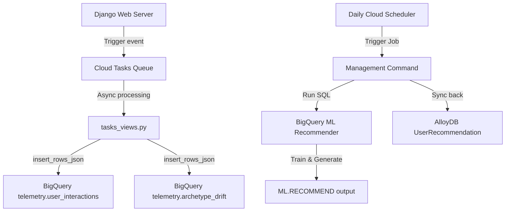

# BigQuery & BigQuery ML User Recommendations Integration Design

## Goal
Implement a serverless user telemetry ingestion pipeline (via Cloud Tasks) to Google Cloud BigQuery, and build a collaborative filtering recommendation engine using BigQuery ML (Matrix Factorization) to sync personalized media recommendations back to AlloyDB daily.

---

## Architecture Overview

The distributed recommendation pipeline consists of three phases:



1. **Ingestion**: PvP duels and gameplay events stream into a unified `telemetry.user_interactions` BigQuery table. User archetype snapshots stream into `telemetry.archetype_drift`.
2. **Model Training**: A nightly management command triggers model training (`CREATE OR REPLACE MODEL ...`) and recommendation generation using Matrix Factorization in BigQuery.
3. **Serving**: The top 10 recommended media items for each active user are synced back to a dedicated table in AlloyDB for sub-millisecond querying by the web application.

---

## Data Schema Design

### 1. BigQuery Telemetry Dataset (`telemetry`)

#### Table: `telemetry.user_interactions`
*   `event_id`: `STRING` (UUID unique)
*   `user_id`: `INTEGER`
*   `media_item_id`: `INTEGER` (Id de l'oeuvre)
*   `interaction_type`: `STRING` (Ex: `'duel_play'`, `'duel_win'`, `'gameplay_play'`, `'gameplay_win'`)
*   `weight`: `FLOAT` (Valeur numérique de feedback implicite)
*   `created_at`: `TIMESTAMP`

#### Table: `telemetry.archetype_drift`
*   `event_id`: `STRING` (UUID unique)
*   `user_id`: `INTEGER`
*   `archetype_id`: `STRING`
*   `intensity`: `FLOAT`
*   `shonen_affinity`: `FLOAT`
*   `seinen_affinity`: `FLOAT`
*   `logic_consistency`: `FLOAT`
*   `created_at`: `TIMESTAMP`

### 2. AlloyDB recommendations model (`backend/api/animetix/models.py`)
```python
class UserRecommendation(models.Model):
    user = models.ForeignKey(User, on_delete=models.CASCADE, related_name='recommendations')
    media_item = models.ForeignKey(MediaItem, on_delete=models.CASCADE)
    score = models.FloatField()
    rank = models.IntegerField()
    updated_at = models.DateTimeField(auto_now=True)

    class Meta:
        ordering = ['rank']
        unique_together = ('user', 'media_item')
```

---

## BigQuery ML SQL Commands

### Model Training
```sql
CREATE OR REPLACE MODEL `telemetry.recommender_model`
OPTIONS(
  model_type='matrix_factorization',
  user_col='user_id',
  item_col='media_item_id',
  rating_col='rating_weight'
) AS
SELECT
  user_id,
  media_item_id,
  SUM(weight) as rating_weight
FROM
  `telemetry.user_interactions`
GROUP BY
  user_id,
  media_item_id
```

### Recommendation Generation (Top-10)
```sql
SELECT
  user_id,
  media_item_id,
  predicted_rating_weight as score,
  ROW_NUMBER() OVER(PARTITION BY user_id ORDER BY predicted_rating_weight DESC) as rank
FROM
  ML.RECOMMEND(MODEL `telemetry.recommender_model`)
WHERE
  predicted_rating_weight IS NOT NULL
QUALIFY
  rank <= 10
```

---

## Implementation Details

### Telemetry Service (`bigquery_service.py`)
Provides methods to stream events to BigQuery.
*   In production, uses `google.cloud.bigquery.Client` to stream rows.
*   In local/testing mode, intercepts requests and writes structured JSON blocks to logs (graceful degradation).

### Nightly Sync Command (`sync_recommendations.py`)
A Django management command `python manage.py sync_bigquery_recommendations` will:
1.  Initialize connection to BigQuery.
2.  Trigger model training SQL execution.
3.  Query results from `ML.RECOMMEND`.
4.  Perform a transaction-safe synchronization to `UserRecommendation` table in AlloyDB.

---

## Verification Plan

### Automated Tests
*   **Unit Tests (`tests/backend/test_bigquery.py`)**:
    *   Test serialization of PvP duel sessions and archetype snapshots.
    *   Test `BigQueryTelemetryService` fallback mode (confirming it logs payload correctly without active GCP connection).
    *   Test the `sync_bigquery_recommendations` management command parsing logic via mocked BigQuery client responses.
