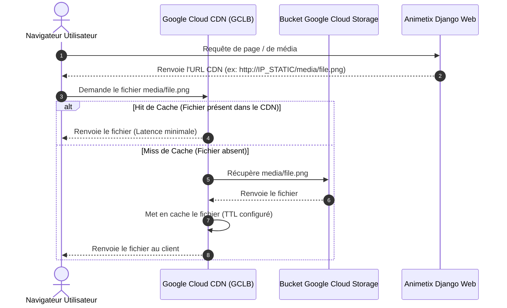

# Design Spec - Mise en cache via Cloud CDN pour Google Cloud Storage

Ce document décrit l'architecture et les détails d'implémentation pour l'intégration de Google Cloud CDN avec le bucket Google Cloud Storage d'Animetix afin de mettre en cache les assets statiques et les médias générés par l'utilisateur.

---

## 1. Objectifs
- Réduire la latence de chargement des ressources médias statiques (Forge, manga, clips audio) pour les utilisateurs finaux en les servant depuis les serveurs Edge de Google.
- Réduire les coûts de facturation de bande passante sortante (egress GCS) en déchargeant le trafic vers Cloud CDN.
- Mettre en place un script d'automatisation idempotent `scripts/deploy/deploy_cdn.py` capable de configurer le Load Balancer Applicatif (GCLB) et le CDN sur GCP.
- Gérer de manière flexible le protocole HTTP classique (via IP statique brute) et HTTPS sécurisé (via certificat SSL géré par Google s'il y a un domaine personnalisé).
- Intégrer l'endpoint CDN dans l'application Django sans perturber le développement local.

---

## 2. Architecture & Flux de Données



---

## 3. Composants Impactés & Modifications

### A. Configuration Django (`backend/api/animetix_project/settings.py`)
Nous ajoutons le support de la variable `GS_CUSTOM_ENDPOINT` pour configurer le point d'accès CDN de `django-storages` :
- Lecture de `GS_CUSTOM_ENDPOINT` via `django-environ`.
- Injection de `custom_endpoint` dans les options de `GoogleCloudStorage`.

```python
GS_CUSTOM_ENDPOINT = env('GS_CUSTOM_ENDPOINT', default=None)

if IS_PRODUCTION or GS_BUCKET_NAME:
    STORAGES = {
        'default': {
            'BACKEND': 'storages.backends.gcloud.GoogleCloudStorage',
            'OPTIONS': {
                'bucket_name': GS_BUCKET_NAME,
                'project_id': env('GOOGLE_CLOUD_PROJECT', default='animetix'),
                'custom_endpoint': GS_CUSTOM_ENDPOINT,
            }
        },
...
```

### B. Script de Déploiement GCP (`scripts/deploy/deploy_cdn.py`)
Ce script configure l'infrastructure CDN de manière idempotente :
1. **Validation & Initialisation** : Vérifie l'activation de `compute.googleapis.com`.
2. **IP Statique Globale** : Crée l'adresse IP externe `animetix-cdn-ip` (ou réutilise si existante).
3. **Backend Bucket GCS** : Crée un backend bucket `animetix-cdn-backend` pointant vers le bucket GCS et y active Cloud CDN avec les paramètres suivants :
   - Mode de cache : `CACHE_ALL_STATIC` (met en cache le contenu statique).
   - TTL maximal : 7 jours (`default-ttl=604800`).
4. **URL Map** : Crée une URL Map `animetix-cdn-url-map` pointant par défaut vers le backend bucket.
5. **Proxy HTTP/HTTPS & Certificats** :
   - *Sans domaine personnalisé* : Crée un target proxy HTTP `animetix-cdn-http-proxy`.
   - *Avec domaine personnalisé* : Crée un certificat SSL géré par Google (`animetix-cdn-cert`), un target proxy HTTPS (`animetix-cdn-https-proxy`) et une règle de redirection HTTP-to-HTTPS automatique.
6. **Forwarding Rules** : Crée la règle globale pour rediriger le trafic de l'IP statique (port 80 / 443) vers le proxy concerné.
7. **Permissions Bucket** : S'assure que le bucket autorise l'accès public en lecture (`allUsers` -> `roles/storage.objectViewer`) pour que le CDN puisse y récupérer les fichiers sans erreur 403.

### C. Fichier de Tests Unitaires (`tests/deploy/test_deploy_cdn.py`)
Création d'une suite de tests qui mocke `subprocess.run` pour s'assurer que toutes les commandes `gcloud` d'activation, de création d'IP, de backend-bucket, d'URL maps et de forwarding rules sont correctement configurées et appelées avec les paramètres attendus.

---

## 4. Plan de Vérification

### Tests Automatisés
- Exécuter la suite de tests unitaires pour valider la génération des commandes de déploiement CDN :
  ```bash
  .venv\Scripts\pytest tests/deploy/test_deploy_cdn.py -v
  ```
- Exécuter le test de validation du stockage Django pour s'assurer du respect de `GS_CUSTOM_ENDPOINT` :
  ```bash
  .venv\Scripts\pytest tests/adapters/test_gcp_deployment_validation.py -v
  ```

### Vérification Manuelle en Production
1. Lancer le script de déploiement pour provisionner le CDN :
   ```bash
   python scripts/deploy/deploy_cdn.py
   ```
2. Vérifier la création de l'IP globale et du backend bucket dans la console GCP Compute Engine.
3. Configurer `GS_CUSTOM_ENDPOINT` dans l'environnement de production.
4. Uploader un fichier média, vérifier que l'URL générée contient l'endpoint personnalisé, et valider l'en-tête HTTP `X-Cache: HIT` / `Age` lors de requêtes successives sur le CDN.
