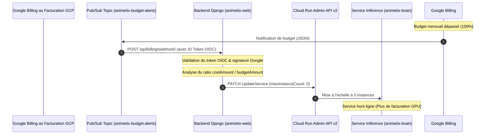

# Spécification - Plafonds budgétaires Cloud Run

Ce document décrit le plan d'architecture et de mise en œuvre pour définir des limites de budget mensuel (Budget Caps) au niveau du service Cloud Run `animetix-brain` (inférence GPU L4) via une désactivation automatique par webhook.

---

## 1. Objectifs
- Prévenir les dérives de facturation accidentelles ou malveillantes (notamment pour l'inférence lourde GPU L4).
- Mettre en place un système automatisé de désactivation (scale to 0) déclenché dès que le budget mensuel du projet ou du service atteint 100%.
- Sécuriser le webhook de notification via l'authentification OIDC de Google.
- Fournir un mécanisme simple d'administration pour restaurer la capacité nominale du service après augmentation ou réinitialisation du budget.

---

## 2. Architecture & Flux de données



---

## 3. Composants Impactés & Modifiés

### A. Webhook Django (`backend/api/animetix/views/billing.py`) [NOUVEAU]
- Un nouveau fichier de vue contenant la fonction `billing_alert_webhook`.
- Exempt de protection CSRF (`@csrf_exempt`).
- Vérifie l'en-tête `Authorization: Bearer <token>` par rapport à Google OIDC.
- Décode la charge Pub/Sub au format Base64.
- Si le ratio `costAmount / budgetAmount >= 1.0`, déclenche l'appel à la fonction de désactivation de la Brain API.

### B. Routage API (`backend/api/animetix/urls/api.py`) [MODIFY]
- Ajout de la route : `path('billing/webhook/', billing_alert_webhook, name='billing_alert_webhook')`.

### C. Services GCP (`backend/api/animetix/services.py`) [NOUVEAU]
- Fonctions d'interaction avec les API GCP via session authentifiée :
  - `shutdown_brain_service()` : Met à jour la configuration en positionnant `template.scaling.maxInstanceCount` à `0`.
  - `restore_brain_service(max_instances=10)` : Restaure la configuration avec la capacité demandée.

### D. Commande d'Administration Django (`backend/api/animetix/management/commands/restore_brain_service.py`) [NOUVEAU]
- Commande CLI d'administration : `python backend/api/manage.py restore_brain_service [--max-instances=10]`.

### E. Script d'automatisation de l'infrastructure (`scripts/deploy/deploy_budget.py`) [NOUVEAU]
- Un nouveau script Python pour orchestrer de manière idempotente :
  1. La création du topic Pub/Sub `animetix-budget-alerts`.
  2. L'association du budget de facturation mensuel avec le topic Pub/Sub.
  3. La création de la souscription Pub/Sub Push ciblant le webhook Django avec un compte de service OIDC configuré.
  4. L'attribution des rôles IAM indispensables (comme `roles/run.developer` pour le compte de service Django sur le service `animetix-brain`).

---

## 4. Sécurité & Contrôles d'Accès

- **Authentification forte :** Le webhook vérifie la validité de la signature cryptographique du jeton OIDC émis par Google (`https://accounts.google.com`).
- **Audience spécifique :** La vérification s'assure que le jeton a été émis pour l'URL exacte du webhook (`GCP_BILLING_WEBHOOK_URL`).
- **Principe de moindre privilège :** Le compte de service exécutant Django n'a besoin que du rôle d'éditeur/développeur de service Cloud Run (`roles/run.developer`) restreint uniquement au service `animetix-brain`, garantissant qu'un compromis du backend ne permet pas de manipuler d'autres services ou la facturation générale.

---

## 5. Plan de Vérification

### Tests Unitaires & Mocking
- Mock de la validation OIDC et du client GCP REST API pour valider les comportements du webhook face à différentes charges Pub/Sub (budget < 100%, budget >= 100%, charge malformée).
- Validation de la commande d'administration Django.

### Tests de Fumée GCP
- Simulation d'un événement de budget factice via la publication manuelle d'un message Pub/Sub :
  ```bash
  gcloud pubsub topics publish animetix-budget-alerts --message='{"billingAccountId":"xxx","budgetDisplayName":"xxx","costAmount":101.0,"budgetAmount":100.0}'
  ```
- Validation dans la console Cloud Run que le service `animetix-brain` a bien été restreint à `max-instances=0`.
