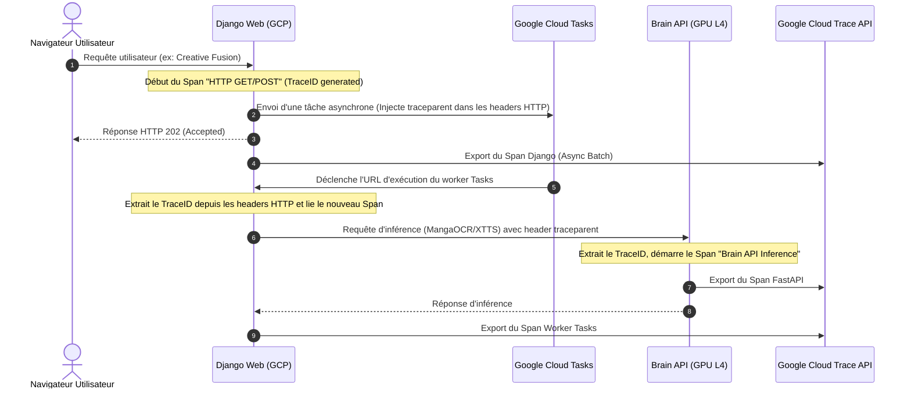

# Design Spec - Observabilité de Bout-en-Bout avec Cloud Trace & Profiler

Ce document détaille la conception et l'implémentation du traçage distribué et du profilage continu à l'aide d'OpenTelemetry, de Google Cloud Trace et de Google Cloud Profiler pour l'ensemble des services Animetix.

---

## 1. Objectifs
- Mettre en place un traçage distribué de bout-en-bout : tracer les requêtes depuis Django Web (`animetix-web`), transitant par les files d'attente asynchrones Google Cloud Tasks, jusqu'à l'exécution et l'inférence ML sur la Brain API (`animetix-brain`) sur Cloud Run.
- Identifier et isoler les goulots d'étranglement de performance et de latence (RAG AlloyDB, Vertex AI API, inférence locale GPU).
- Intégrer Google Cloud Profiler pour mesurer en continu la consommation de CPU et de mémoire dans les conteneurs de production.
- Assurer un fonctionnement non bloquant et résilient (les pannes de l'API de trace ne doivent pas faire planter l'application).

---

## 2. Architecture du Traçage Distribué

### Propagation du Contexte W3C
Pour lier les traces entre les appels réseau HTTP et les tâches asynchrones, nous utilisons le standard W3C `traceparent` (contenant `Version-TraceID-ParentID-Flags`). Ce contexte est sérialisé et injecté dans les en-têtes des tâches et des requêtes API REST, puis désérialisé à la réception pour rattacher le nouveau segment de trace au span parent.

---

## 3. Composants Impactés & Modifications

### A. Dépendances (`requirements.txt`)
Nous ajoutons les bibliothèques GCP requises :
- `opentelemetry-exporter-gcp-trace` : Exportateur natif vers GCP Cloud Trace.
- `google-cloud-profiler` : Agent de profilage continu GCP.

### B. Module Centralisé de Télémétrie (`backend/api/animetix/telemetry.py`)
Création de ce module pour configurer OpenTelemetry et Cloud Profiler de manière résiliente :
- Initialise l'agent Profiler si `DJANGO_ENV=production`.
- Configure le `TracerProvider` d'OpenTelemetry.
- En production, associe le span processor à `CloudTraceSpanExporter` pour la collecte asynchrone.
- Fournit des helpers pour l'injection/extraction de contexte W3C.

### C. Django Middleware et Configuration
*   **Enregistrement dans [apps.py](file:///c:/Users/bahma/PycharmProjects/Projet%20solo/Double_scenario_Project/backend/api/animetix/apps.py)** : Lancer `init_telemetry("animetix-web")` lors du boot de l'application Django.
*   **Création de `TracingMiddleware` dans [middleware.py](file:///c:/Users/bahma/PycharmProjects/Projet%20solo/Double_scenario_Project/backend/api/animetix/middleware.py)** :
    - Middleware HTTP léger interceptant les requêtes entrantes pour créer un span OpenTelemetry.
    - Extrait et lie le contexte de trace s'il provient d'IAP ou d'une tâche Cloud Tasks.
*   **Enregistrement dans [settings.py](file:///c:/Users/bahma/PycharmProjects/Projet%20solo/Double_scenario_Project/backend/api/animetix_project/settings.py)** : Activer le middleware.

### D. Instrumentation de la Brain API (FastAPI)
*   **Fichier :** [brain_api.py](file:///c:/Users/bahma/PycharmProjects/Projet%20solo/Double_scenario_Project/backend/adapters/inference/brain_api.py)
    - Lancer `init_telemetry("animetix-brain")` au démarrage.
    - Ajouter un middleware FastAPI pour intercepter les requêtes entrantes, extraire le contexte de trace W3C et créer le span d'inférence.

### E. Propagation dans Cloud Tasks
*   **Fichier :** [tasks_client.py](file:///c:/Users/bahma/PycharmProjects/Projet%20solo/Double_scenario_Project/backend/api/animetix/tasks_client.py)
    - Lors de la création d'une tâche, injecter les headers de trace issus du span actif dans les en-têtes HTTP de la tâche Cloud Tasks.

---

## 4. Plan de Vérification

### Tests Automatisés
- Écriture de `tests/backend/test_telemetry.py` validant :
  - La propagation correcte du contexte de trace (injection et extraction).
  - Le fonctionnement silencieux de l'initialisation en mode local.
  - Le comportement du middleware Django et de la Brain API.

### Vérification Manuelle en Production
1. Déployer les services sur Cloud Run.
2. Déclencher un scénario asynchrone (ex: Creative Fusion).
3. Consulter l'interface **Cloud Trace** sur la console Google Cloud pour visualiser les diagrammes de cascade de latence associant les requêtes `animetix-web`, la tâche de queue, et l'inférence ML `animetix-brain`.
4. Consulter l'interface **Cloud Profiler** pour voir les Flame Graphs d'utilisation des ressources.
