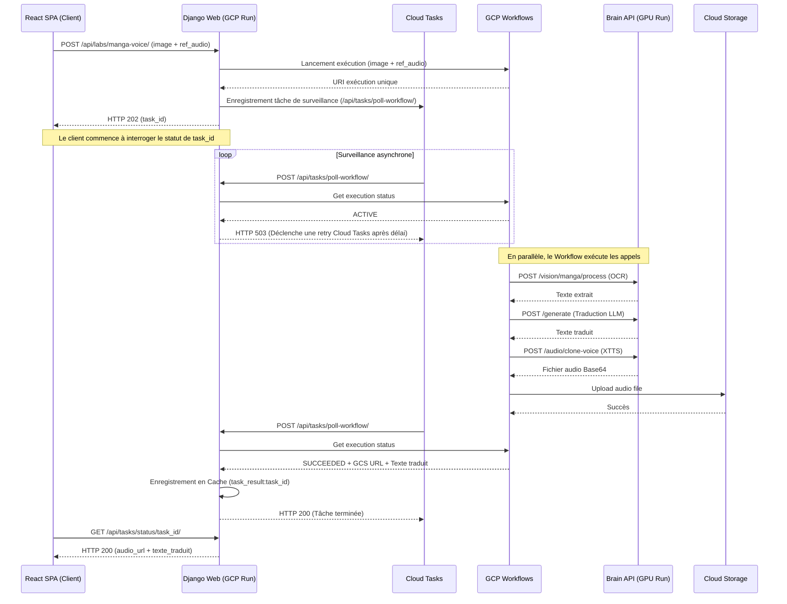

# Spécification Technique - Intégration Google Cloud Workflows (Pipeline Manga-Voice)

Ce document décrit le plan d'architecture pour l'intégration de **Google Cloud Workflows** afin de coordonner de manière résiliente et serverless le pipeline multi-étapes (OCR de planches -> Traduction par LLM -> Synthèse de voix XTTS) sans surcharger le serveur principal Django.

---

## 1. Objectifs & Bénéfices

*   **Déchargement complet :** Éviter de bloquer des threads Django ou des workers Celery pendant les phases d'inférence lourdes (OCR, LLM, XTTS) qui peuvent prendre plus de 10 secondes.
*   **Résilience serverless :** Laisser Google Cloud Workflows gérer le cycle de vie, les états intermédiaires et les tentatives d'exécution (retries) en cas de cold-start de la Brain API (GPU L4).
*   **Hybridation pour le développement local :** En mode local (`IS_PRODUCTION = False`), le pipeline s'exécute de manière synchrone et séquentielle en appelant les adaptateurs Python existants afin de garantir une expérience de développement autonome et sans dépendance GCP externe.

---

## 2. Architecture & Flux

### Production (GCP) :


---

## 3. Composants à Modifier / Créer

### A. Fichier de Workflow (`deploy/workflows/manga_voice_pipeline.yaml`) [NEW]
Ce fichier décrit le graphe d'exécution serverless de GCP Workflows :
1. OCR de l'image via la Brain API.
2. Traduction du texte via `/generate` de la Brain API.
3. Synthèse audio vocale via `/audio/clone-voice` (XTTS) de la Brain API.
4. Téléversement du binaire audio directement vers un bucket Cloud Storage via le connecteur natif `googleapis.storage.v1.objects.insert`.

### B. Client Python (`backend/adapters/inference/workflows_client.py`) [NEW]
Fournit la classe `GCPWorkflowsClient` encapsulant les appels à `google-cloud-workflows` et `google.cloud.workflows.executions_v1` :
*   `trigger_pipeline(...)` : Lancer l'exécution du workflow avec les paramètres nécessaires.
*   `get_execution_status(...)` : Récupérer le statut actuel et le résultat JSON.

### C. Django Views & Tasks Integration
1.  **Modification de `backend/api/animetix/api/labs.py` :**
    *   Ajout de la route `/api/labs/manga-voice/`.
    *   Si `settings.IS_PRODUCTION = True` : Lancement du workflow GCP, création de la tâche Cloud Tasks pour la surveillance, et retour immédiat d'un `task_id`.
    *   Si `settings.IS_PRODUCTION = False` : Exécution locale synchrone en appelant directement `MangaFlowService` et l'adaptateur de synthèse vocale local, écriture du résultat directement en cache et retour immédiat.
2.  **Modification de `backend/api/animetix/tasks_views.py` :**
    *   Ajout de l'endpoint `/api/tasks/poll-workflow/`.
    *   Vérification du jeton OIDC de Google.
    *   Lecture du statut GCP Workflows. Si en cours : HTTP `503`. Si terminé : écriture en cache et HTTP `200`. Si erreur : écriture en cache avec état `FAILED` et HTTP `200`.

### D. Configuration Django (`backend/api/animetix_project/settings.py`)
Ajout des variables d'environnement suivantes :
```python
GCP_WORKFLOW_ID = env('GCP_WORKFLOW_ID', default='manga-voice-pipeline')
GCP_LOCATION = env('GCP_LOCATION', default='europe-west1')
```

---

## 4. Plan de Vérification

### Tests Automatisés
*   Créer `tests/core/test_workflows_integration.py` :
    *   Tester le fallback local synchrone (mocker les services d'inférence sous-jacents).
    *   Tester le client `GCPWorkflowsClient` en mockant les appels réseau vers l'API de Google Cloud Workflows.
    *   Tester la vue de polling `/api/tasks/poll-workflow/` en simulant les statuts `ACTIVE`, `SUCCEEDED`, et `FAILED`.

### Validation Manuelle
*   Déployer le fichier de workflow YAML sur GCP via la commande `gcloud`.
*   Lancer une requête depuis la page "Forge Créative" et vérifier le flux complet via la console GCP Workflows.
