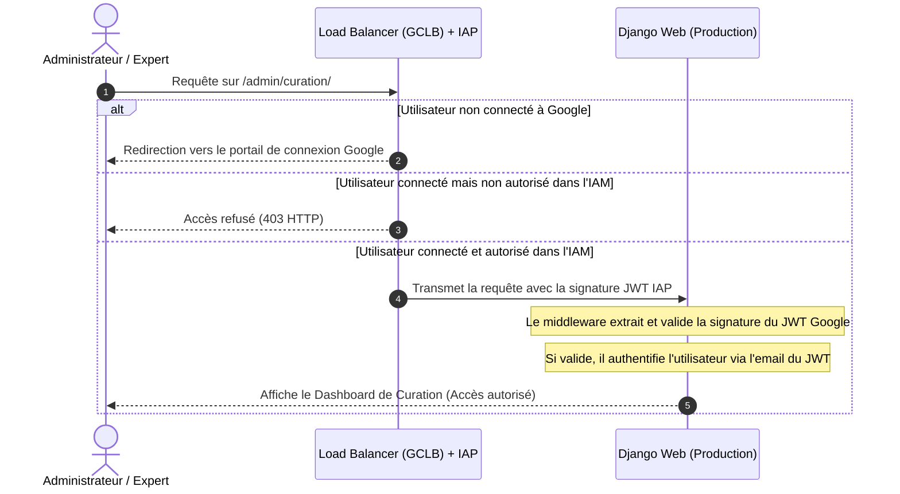

# Design Spec - Sécurisation via Identity-Aware Proxy (IAP)

Ce document détaille l'architecture et les composants requis pour intégrer Google Cloud Identity-Aware Proxy (IAP) avec l'authentification Django afin de sécuriser l'accès aux dashboards sensibles en production.

---

## 1. Objectifs
- Restreindre l'accès aux dashboards administratifs et d'experts (Curation, Visual Graph Debugger, MLOps, SOTA Benchmarks) en s'appuyant sur l'authentification Google native vérifiée par IAP.
- Empêcher tout accès non autorisé ou tentative de contournement des contrôles en validant la signature du JWT injecté par IAP (`X-Goog-IAP-JWT-Assertion`) en production.
- Fournir une intégration transparente avec le système d'authentification natif de Django via un Middleware et un Backend d'authentification personnalisés.
- Permettre un fonctionnement fluide en mode local (développement) sans perturber le login session classique ou OAuth2.

---

## 2. Architecture & Sécurité



### Signature et Validation du JWT
IAP injecte l'en-tête HTTP `X-Goog-IAP-JWT-Assertion`. Le backend effectue les validations suivantes :
1. **Signature cryptographique** : Le jeton doit être signé par l'une des clés publiques de Google récupérées en temps réel depuis `https://www.gstatic.com/iap/verify/public_key`.
2. **Audience (`aud`)** : Doit correspondre à la valeur attendue configurée pour le backend GCLB (ex: `/projects/PROJECT_NUMBER/global/backendServices/SERVICE_ID`).
3. **Émetteur (`iss`)** : Doit être égal à `https://cloud.google.com/iap`.
4. **Expiration (`exp`)** : Le jeton doit être valide à l'instant de la requête.

---

## 3. Composants Impactés & Modifications

### A. Création du module d'Authentification IAP (`backend/api/animetix/auth.py`)
Ce module contiendra les classes nécessaires pour s'interfacer avec Django :

- **`IAPRemoteUserMiddleware`** : Hérite de `RemoteUserMiddleware` et extrait l'en-tête `HTTP_X_GOOG_IAP_JWT_ASSERTION`.
  - Valide la signature avec `google.oauth2.id_token.verify_token`.
  - Lève une exception `PermissionDenied` (HTTP 403) si le token est invalide ou expiré.
  - Extrait l'adresse email et l'affecte à `REMOTE_USER`.
- **`IAPRemoteUserBackend`** : Hérite de `RemoteUserBackend` et gère le cycle de vie de l'utilisateur :
  - Crée l'utilisateur Django si inexistant.
  - Met à jour les privilèges `is_staff` et `is_superuser` en fonction d'une liste blanche d'adresses email autorisées (`IAP_APPROVED_ADMIN_EMAILS`).

### B. Configuration Django (`backend/api/animetix_project/settings.py`)
Mise à jour des paramètres :
1. **Middleware** : Ajouter le middleware IAP juste après `AuthenticationMiddleware`.
2. **Authentication Backends** : Ajouter `backend.api.animetix.auth.IAPRemoteUserBackend` aux backends d'authentification.
3. **Settings IAP** :
   ```python
   GCP_IAP_AUDIENCE = env('GCP_IAP_AUDIENCE', default=None)
   IAP_APPROVED_ADMIN_EMAILS = env.list('IAP_APPROVED_ADMIN_EMAILS', default=[])
   ```

### C. Fichier de Tests (`tests/backend/test_iap_auth.py`)
Création de tests unitaires validant :
- L'authentification réussie avec un JWT valide.
- Le rejet (PermissionDenied) avec un JWT invalide ou expiré.
- L'attribution et la révocation automatique des droits d'administration (`is_staff`/`is_superuser`).
- Le bypass propre du middleware en local si aucun en-tête IAP n'est fourni.

---

## 4. Plan de Vérification

### Tests Automatisés
```bash
.venv\Scripts\pytest tests/backend/test_iap_auth.py -v
```

### Vérification en Production
1. Activer IAP sur le service de backend du Load Balancer via la console GCP ou `gcloud`.
2. Configurer `GCP_IAP_AUDIENCE` et `IAP_APPROVED_ADMIN_EMAILS` via les variables d'environnement de Cloud Run.
3. Tenter d'accéder à `/admin/` en prod et valider la connexion Google automatique et les droits d'administration.
