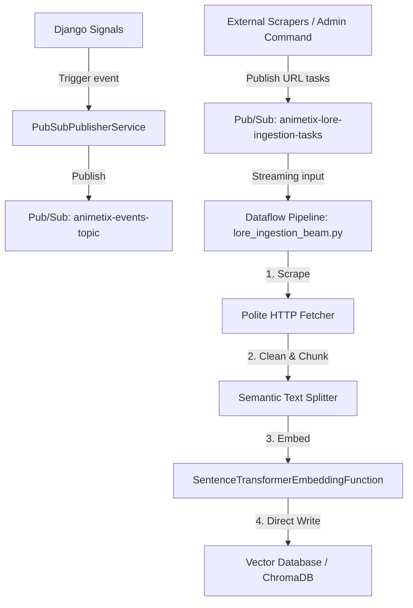

# Event-Driven Architecture (Pub/Sub & Dataflow Real-Time Lore Ingestion) Design

## Goal
Implement a serverless event-driven architecture that publishes major telemetry events to Google Cloud Pub/Sub topics to decouple secondary analytics, and orchestrate a real-time wiki/lore ingestion streaming pipeline using Google Cloud Dataflow (Apache Beam) to populate the vector search database.

---

## Architecture Overview



1. **Event Publishing (Decoupled Analytics)**: Major events (`duel_completed`, `archetype_drift_created`) are automatically intercepted via Django signal listeners and dispatched to Pub/Sub. In non-production environments, this gracefully falls back to structured logging.
2. **Streaming Ingestion**: Lore ingestion tasks (URLs and metadata) are published to a dedicated Pub/Sub topic.
3. **Dataflow (Apache Beam) Execution**: A streaming pipeline reads from the Pub/Sub topic, fetches URL content, extracts and chunks text ssemantically, generates high-quality text embeddings, and inserts them directly into the vector repository.

---

## Pub/Sub Event Schemas

### 1. Topic: `animetix-events-topic`

#### Event: `duel_completed`
Published when a `DuelRoom` is completed:
```json
{
  "event_id": "string (UUID)",
  "event_type": "duel_completed",
  "room_id": "integer",
  "player1_id": "integer or null",
  "player2_id": "integer or null",
  "winner_id": "integer or null",
  "secret_title": "string",
  "media_type": "string",
  "timestamp": "string (ISO 8601)"
}
```

#### Event: `archetype_drift_created`
Published when an `ArchetypeDriftSnapshot` is created:
```json
{
  "event_id": "string (UUID)",
  "event_type": "archetype_drift_created",
  "snapshot_id": "integer",
  "user_id": "integer",
  "archetype_id": "string",
  "intensity": "float",
  "shonen_affinity": "float",
  "seinen_affinity": "float",
  "logic_consistency": "float",
  "timestamp": "string (ISO 8601)"
}
```

### 2. Topic: `animetix-lore-ingestion-tasks`

Published to trigger the real-time processing of lore documents:
```json
{
  "url": "string (fully qualified URL)",
  "franchise": "string (e.g. 'One Piece', 'Naruto')"
}
```

---

## Dataflow (Apache Beam) Pipeline Design

The Python script `backend/pipeline/mlops/lore_ingestion_beam.py` will implement an Apache Beam pipeline:

### 1. Streaming Steps (PTransforms)
*   `ReadFromPubSub`: Reads messages from subscription `projects/{project}/subscriptions/animetix-lore-ingestion-tasks-sub`.
*   `ParsePayload`: Decodes byte payloads to JSON dictionaries.
*   `ScrapeAndCleanDoFn`:
    *   Executes a polite HTTP fetch of the target URL using `safe_http_request`.
    *   Uses BeautifulSoup/Regex to strip HTML tag noise and advertisements, extracting raw descriptive text.
*   `ChunkTextDoFn`: Splits the cleaned text into semantic chunks (~400 characters) at sentence boundaries.
*   `GenerateEmbeddingsDoFn`:
    *   Generates vector embeddings for each chunk using `jinaai/jina-embeddings-v3` SentenceTransformer model.
    *   *Graceful degradation:* If the model cannot load, generates mock embeddings (list of floats) to facilitate development/local testing.
*   `WriteToVectorDBDoFn`:
    *   Obtains an instance of `PGVectorRepositoryAdapter`.
    *   Performs bulk upsert of chunks and vectors to the corresponding collection (e.g., `anime_thematic`, `manga_thematic`).

### 2. Execution Run Configurations
*   **Production**: Triggered using GCP Dataflow service:
    ```bash
    python lore_ingestion_beam.py --runner=DataflowRunner --project=YOUR_PROJECT --temp_location=gs://your-bucket/temp --staging_location=gs://your-bucket/staging --streaming
    ```
*   **Local Development**: Executed locally without cloud configuration:
    ```bash
    python lore_ingestion_beam.py --runner=DirectRunner --streaming
    ```

---

## Verification Plan

### Automated Tests
*   **Unit Tests (`tests/backend/test_pubsub_pipeline.py`)**:
    *   Verify `PubSubPublisherService` local mock logger fallback.
    *   Verify Django signals trigger event publication when a duel finishes or drift occurs.
    *   Test Apache Beam pipeline processing flow locally using the `DirectRunner` with mocked Pub/Sub inputs and mocked HTTP responses.
    *   Ensure database insertions succeed post-pipeline execution.
