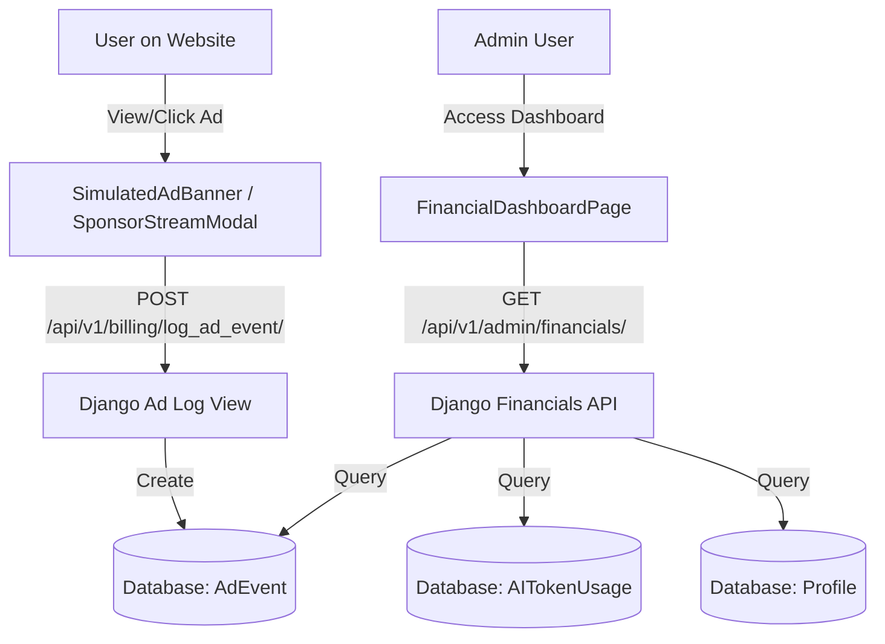

# Design Spec: Admin Financial Dashboard & Ad Equalizer

This document details the implementation of the Admin Financial Dashboard page and the ad-cost tracking system for Animetix.

## 1. Goal & Context
The site incurs ongoing AI API costs (tracked in `AITokenUsage`). We want to allow administrators to:
- Track all AI costs by engine.
- Track real/simulated ad impressions and clicks.
- Track estimated donation revenues from users with the `"Sponsor Or"` badge.
- Use an interactive slider simulator to equalize these costs with ads and donations, calculating required break-even targets in real-time.

---

## 2. Architecture & Data Flow



---

## 3. Detailed Components

### A. Backend Schema Changes (Django)
We will introduce the `AdEvent` model in `backend/api/animetix/models.py`:

```python
class AdEvent(models.Model):
    EVENT_TYPES = [('impression', 'Impression'), ('click', 'Click')]
    AD_TYPES = [('video', 'Video'), ('banner', 'Banner')]

    event_type = models.CharField(max_length=20, choices=EVENT_TYPES)
    ad_type = models.CharField(max_length=20, choices=AD_TYPES)
    created_at = models.DateTimeField(auto_now_add=True)

    def __str__(self):
        return f"{self.ad_type} {self.event_type} at {self.created_at}"
```

### B. Django API Views (`backend/api/animetix/api/admin_api.py`)
1. **`POST /api/v1/billing/log_ad_event/`**:
   - Logs an ad impression or click event.
   - Public view, no auth required (ads are served to anonymous users).
   - Validates `event_type` and `ad_type`.

2. **`GET /api/v1/admin/financials/`**:
   - Permission: `IsAdminUser`.
   - Queries:
     - Total AI costs from `AITokenUsage.objects.aggregate(Sum('cost_estimate'))`.
     - Cost breakdown by `engine`.
     - Count of `"Sponsor Or"` badges in `Profile.objects.filter(unlocked_badges__contains="Sponsor Or")`.
     - Counts of `AdEvent` filtered by type/event.
   - Calculates baseline ad revenues:
     - `video_impressions` * $3.00 / 1000
     - `banner_impressions` * $1.00 / 1000
     - `clicks` * $0.15
     - `sponsors` * $5.00
   - Returns aggregated financial values, counts, and calculated margins.

### C. Frontend Admin Page (`frontend/src/pages/admin/FinancialDashboardPage.tsx`)
- Displays KPI Cards: Total AI Cost, Total Ad Revenue, Donations, Net Balance.
- Interactive Simulator (Equalizer):
  - Sliders for CPM and CPC rates.
  - Dynamically recalculates break-even numbers (e.g. required video impressions to cover the deficit).
- AI Engine Cost Breakdown list.
- Recommendation Box showing dynamic instructions to balance the budget.

### D. Ad Logging Hooks
- **`SimulatedAdBanner.tsx`**:
  - `useEffect`: Log `impression` for `banner`.
  - `handleCtaClick`: Log `click` for `banner`.
- **`SponsorStreamModal.tsx`**:
  - Log `impression` for `video` when playback starts.

---

## 4. Verification & Testing
- **Backend Tests**: Verify `AdEvent` is correctly logged. Verify `/api/v1/admin/financials/` calculates aggregates and enforces admin authentication.
- **Manual Verification**: Run simulator sliders, trigger simulated ads, and verify logs appear in backend/DB.
