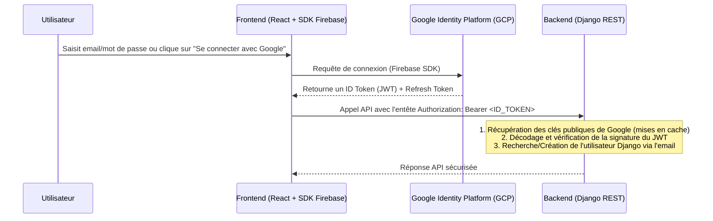

# Spécification Technique : Migration vers Google Identity Platform (GCIP)

## 1. Contexte et Objectifs
Le projet utilise actuellement une authentification hybride :
- En local/dev : Authentification par sessions Django (`SessionAuthentication`) et `django-allauth` pour l'authentification sociale.
- En production : Authentification par IAP (Identity-Aware Proxy) pour la sécurité des administrateurs, mais l'authentification de l'application reste basée sur des sessions de base de données.

Cette spécification décrit la migration complète de l'authentification applicative vers **Google Identity Platform (GCIP)**, qui s'appuie sur l'infrastructure de Firebase Authentication. 

### Objectifs :
- Supprimer la gestion et le stockage des mots de passe en base de données Django.
- Passer à un modèle stateless basé sur des tokens JWT à courte durée de vie.
- Supporter la connexion par **Email/Mot de passe**, **Google OAuth**, **Discord OAuth** et **X (Twitter) OAuth** de manière native.
- Garantir le support du développement local via l'émulateur Firebase Auth.

---

## 2. Architecture et Flux de Données



---

## 3. Spécifications du Backend (Django)

### 3.1. Classe d'Authentification : `GoogleIdentityAuthentication`
Nous allons créer cette classe dans `backend/api/animetix/auth.py`. Elle héritera de `rest_framework.authentication.BaseAuthentication`.

#### Logique de validation du JWT :
1. Extraction du token depuis l'entête HTTP `Authorization` (`Bearer <token>`).
2. Si `FIREBASE_AUTH_EMULATOR_HOST` est défini dans l'environnement, le backend utilise les clés locales ou décode le token sans vérification de signature cryptographique stricte pour simplifier les tests et le développement local hors ligne.
3. En production :
   - Récupération des clés de signature publiques de Google depuis l'URL : `https://www.googleapis.com/robot/v1/metadata/x509/securetoken-system@system.gserviceaccount.com`.
   - Mise en cache en mémoire (Django Cache) de ces certificats en utilisant l'entête `Cache-Control` (généralement valide 6+ heures).
   - Validation cryptographique du token avec `PyJWT` (algorithme `RS256`).
   - Validation des claims du JWT :
     - `iss` (Issuer) doit être exactement `https://securetoken.google.com/<GOOGLE_CLOUD_PROJECT>`.
     - `aud` (Audience) doit être exactement `<GOOGLE_CLOUD_PROJECT>`.
     - `exp` (Expiration) doit être dans le futur.
4. Identification de l'utilisateur :
   - Extraction du claim `email` et du claim `sub` (UID GCIP unique).
   - Recherche en base de données de l'utilisateur Django via `User.objects.get(email=email)`.
   - Si l'utilisateur n'existe pas, il est créé à la volée :
     - `username` de base généré depuis la partie locale de l'email (ex: `bahma` pour `bahma@domain.com`).
     - Gestion des collisions : si le username existe déjà, génération d'un suffixe aléatoire (ex: `bahma_x4a1`).
     - Association d'un mot de passe inutilisable via `user.set_unusable_password()`.
     - Création automatique du profil associé (via le signal de création existant).

### 3.2. Configuration `settings.py`
Mise à jour des middlewares et des backends d'authentification REST :
```python
# settings.py
REST_FRAMEWORK = {
    'DEFAULT_SCHEMA_CLASS': 'drf_spectacular.openapi.AutoSchema',
    'DEFAULT_PERMISSION_CLASSES': ['rest_framework.permissions.IsAuthenticatedOrReadOnly'],
    'DEFAULT_AUTHENTICATION_CLASSES': [
        'backend.api.animetix.auth.GoogleIdentityAuthentication',
    ],
    ...
}
```

Désactivation des endpoints d'authentification locale :
- `/api/v1/auth/login/` -> Renvoyer `405 Method Not Allowed`.
- `/api/v1/auth/register/` -> Renvoyer `405 Method Not Allowed`.
- `/api/v1/auth/logout/` -> Renvoyer `405 Method Not Allowed`.
- `/api/v1/auth/me/` -> Reste actif pour renvoyer le profil Django de l'utilisateur connecté via JWT.

---

## 4. Spécifications du Frontend (React)

### 4.1. Installation du SDK Firebase
```bash
npm install firebase
```

### 4.2. Configuration Firebase (`frontend/src/utils/firebase.ts`)
Création du fichier d'initialisation :
```typescript
import { initializeApp } from 'firebase/app';
import { getAuth, connectAuthEmulator } from 'firebase/auth';

const firebaseConfig = {
  apiKey: import.meta.env.VITE_FIREBASE_API_KEY,
  authDomain: import.meta.env.VITE_FIREBASE_AUTH_DOMAIN,
  projectId: import.meta.env.VITE_FIREBASE_PROJECT_ID,
  appId: import.meta.env.VITE_FIREBASE_APP_ID,
};

export const app = initializeApp(firebaseConfig);
export const auth = getAuth(app);

// Prise en charge de l'émulateur en local
const emulatorHost = import.meta.env.VITE_FIREBASE_AUTH_EMULATOR_HOST;
if (emulatorHost) {
  connectAuthEmulator(auth, `http://${emulatorHost}`);
}
```

### 4.3. Injection automatique des tokens dans `apiClient.ts`
Mise à jour de `apiClient.ts` pour récupérer de manière asynchrone l'ID token actif de Firebase et l'insérer dans l'entête `Authorization` :
```typescript
import { auth } from './firebase';

// ... dans apiClient ...
const firebaseUser = auth.currentUser;
if (firebaseUser) {
  try {
    const token = await firebaseUser.getIdToken();
    defaultHeaders['Authorization'] = `Bearer ${token}`;
  } catch (err) {
    console.error("Impossible d'obtenir l'ID Token Firebase:", err);
  }
}
```

### 4.4. Adaptation du Store d'Authentification (`authStore.ts`)
Nous utiliserons le SDK Firebase Auth pour toutes les actions :
- `login(email, password)` -> `signInWithEmailAndPassword(auth, email, password)`.
- `register(email, password)` -> `createUserWithEmailAndPassword(auth, email, password)`.
- `logout()` -> `signOut(auth)`.
- `loginWithGoogle()` -> `signInWithPopup(auth, new GoogleAuthProvider())`.
- `loginWithDiscord()` -> `signInWithPopup(auth, new OAuthProvider('oauth.discord'))` avec les scopes `identify` et `email`.
- `loginWithX()` -> `signInWithPopup(auth, new TwitterAuthProvider())`.
- `checkAuth()` -> Écoute réactive de `onAuthStateChanged(auth, async (firebaseUser) => { ... })` pour mettre à jour l'utilisateur et récupérer le profil Django `/api/v1/auth/me/`.

---

## 5. Plan de Migration et Variables d'Environnement

### Variables d'environnement requises :
#### Backend (`.env`) :
- `GOOGLE_CLOUD_PROJECT`: ID du projet GCP (ex: `animetix`).
- `FIREBASE_AUTH_EMULATOR_HOST`: Optionnel (ex: `127.0.0.1:9099` pour le développement local).

#### Frontend (`frontend/.env`) :
- `VITE_FIREBASE_API_KEY`: Clé API publique Firebase.
- `VITE_FIREBASE_AUTH_DOMAIN`: Domaine d'authentification (ex: `<project-id>.firebaseapp.com`).
- `VITE_FIREBASE_PROJECT_ID`: ID du projet GCP.
- `VITE_FIREBASE_APP_ID`: ID unique de l'application Firebase.
- `VITE_FIREBASE_AUTH_EMULATOR_HOST`: Optionnel (ex: `localhost:9099` en dev).

### 5.1. Configuration de Discord et de X (Twitter) sur la Console Google Identity Platform
#### Discord :
Pour que la connexion Discord fonctionne en production, il faut configurer Discord comme fournisseur personnalisé dans la console Google Cloud :
1. Allez sur la console Google Cloud, puis **Identity Platform** > **Fournisseurs d'identité** > **Ajouter un fournisseur**.
2. Sélectionnez **Personnalisé** (Custom OAuth 2.0).
3. Remplissez les champs de configuration :
   - **ID du fournisseur** : `oauth.discord` (obligatoire pour correspondre au code frontend).
   - **ID client** : ID client de l'application Discord (portail développeurs Discord).
   - **Secret client** : Clé secrète de l'application Discord.
   - **URI d'autorisation** : `https://discord.com/api/oauth2/authorize`
   - **URI de jeton** : `https://discord.com/api/oauth2/token`
   - **URI d'informations utilisateur** : `https://discord.com/api/users/@me`
4. Copiez l'**URI de redirection de confiance** fourni par GCP et ajoutez-le aux redirect URIs dans les paramètres de votre application Discord (ex: `https://<gcp-project>.firebaseapp.com/__/auth/handler`).

#### X (Twitter) :
Pour X, Identity Platform intègre nativement le fournisseur d'identité :
1. Allez sur **Identity Platform** > **Fournisseurs d'identité** > **Ajouter un fournisseur**.
2. Sélectionnez **Twitter** dans la liste des fournisseurs populaires.
3. Renseignez l'**API Key** et la **Secret Key** fournies par le portail développeurs X (Twitter Developer Portal).
4. Copiez l'URI de redirection et ajoutez-le aux paramètres de votre projet sur le portail développeurs X.
5. Enregistrez pour activer.

---

## 6. Plan de Validation et Tests

### 6.1. Tests Unitaires Backend
- Validation d'un JWT valide : Simuler la récupération des clés publiques et s'assurer que l'utilisateur Django est correctement récupéré/créé avec les bonnes permissions.
- Rejet d'un JWT expiré ou d'une mauvaise audience : S'assurer que le backend lève une erreur `AuthenticationFailed`.
- Support de l'émulateur : Vérifier que si `FIREBASE_AUTH_EMULATOR_HOST` est actif, le décodage sans signature est accepté.

### 6.2. Tests Intégration / Manuels
- Lancer l'émulateur Firebase local (si disponible) ou se connecter à un projet GCP de test.
- Vérifier le flux complet d'inscription / connexion via le formulaire email/mot de passe.
- Vérifier le fonctionnement du bouton de connexion Google.
- Valider que les requêtes API reçoivent correctement l'entête Bearer.
