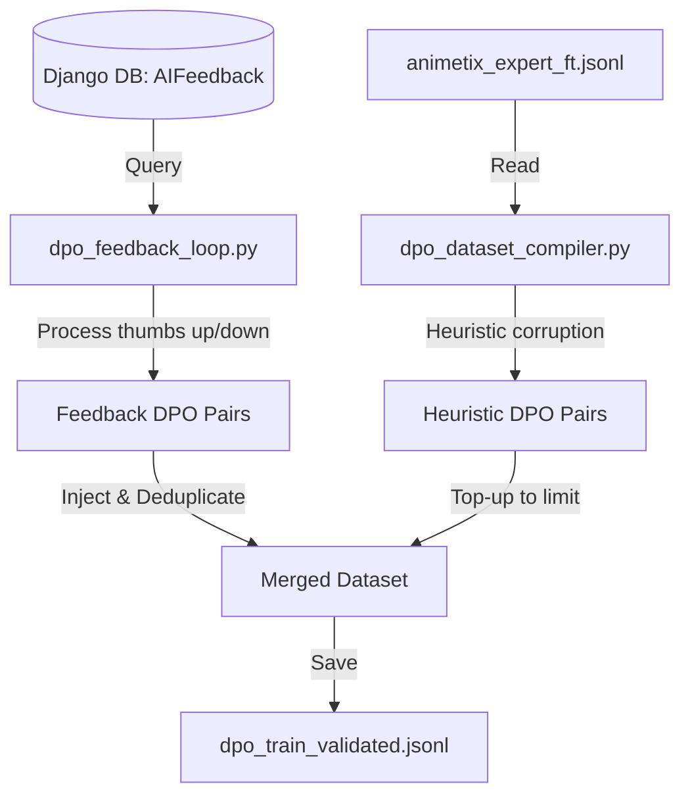

# Design Spec: DPO Feedback Loop Integration

This document specifies the integration of real user feedback (thumbs up/down) collected via the Django web application into the offline DPO (Direct Preference Optimization) preference dataset compilation pipeline.

## 1. Goal & Context
Currently, the DPO compiler (`dpo_dataset_compiler.py`) relies entirely on offline heuristics to generate rejected responses from existing SFT outputs. While effective, this ignores real user feedback collected via the Django database. 
By integrating the `AIFeedback` model from Django, we can:
- Leverage real thumbs-up responses as high-quality `chosen` samples.
- Leverage real thumbs-down responses as high-quality `rejected` samples.
- Use an Oracle model (Gemini) to rewrite/correct thumbs-down responses to serve as their corresponding `chosen` counterparts.

## 2. Architecture & Data Flow



## 3. Django Environment Initialization
Since the pipeline scripts run outside the standard Django app server and are located inside `backend/pipeline/mlops/`, we must manually initialize the Django environment. 
To prevent name conflicts with the third-party `pipeline` package installed in the python virtual environment (name shadowing), the paths must be inserted at the beginning of `sys.path`:

```python
import sys
import os

backend_path = os.path.abspath(os.path.join(os.path.dirname(__file__), "..", ".."))
sys.path.insert(0, backend_path)
api_path = os.path.join(backend_path, "api")
sys.path.insert(0, api_path)

os.environ.setdefault('DJANGO_SETTINGS_MODULE', 'animetix_project.settings')

import django
django.setup()
```

If Django is not available or the database is missing/unreachable, the script must catch the exception, print a warning, and fall back to returning an empty feedback list to ensure offline stability.

## 4. DPO Pair Construction Logic

Each database record of the `AIFeedback` model contains the following relevant fields:
- `input_context`: The user prompt.
- `output_text`: The generated response.
- `is_positive`: Boolean flag indicating user satisfaction (True = thumbs up, False = thumbs down).

### A. Positive Feedback (`is_positive == True`)
- **Chosen**: The original generated response (`output_text`).
- **Rejected**: A corrupted version of `chosen` generated dynamically using the compiler's `corrupt_tonal_deviation` or `corrupt_evasive_refusal` strategies (ensuring the model learns to prefer the original style over bad tone/refusals).

### B. Negative Feedback (`is_positive == False`)
- **Rejected**: The original generated response (`output_text`), which the user disliked.
- **Chosen**: An Oracle-corrected version generated using the Gemini API client. If the Gemini API key is missing or the call fails, this sample is skipped entirely to prevent low-quality chosen samples.

## 5. Merging & Heuristic Top-up
In `compile_dpo_pairs(sft_path, output_path, limit, seed)`:
1. Try fetching and compiling Django feedback pairs.
2. Deduplicate them (by checking prompt text).
3. If the number of feedback pairs is less than `limit`, fill the remainder of the dataset by parsing and corrupting eligible entries from the SFT dataset file.
4. Save the combined list of pairs to `dpo_train_validated.jsonl`.

## 6. Verification Plan
- **Mock Unit Testing**: Update `tests/mlops/test_dpo_dataset_compiler.py` to test the feedback merging logic. We will mock the database queries so the tests run deterministically and offline without requiring a live Django database.
- **End-to-End Test**: Verify running the compiler with mock feedback entries compiles them successfully.
