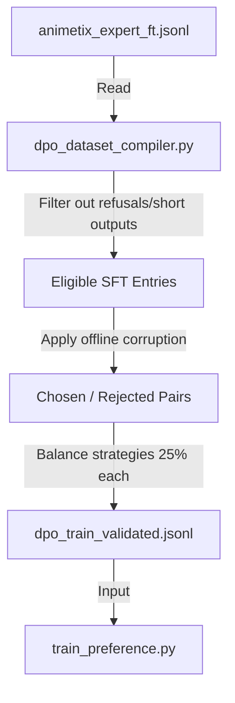

# Design Spec: DPO Preference Dataset Compiler

This document specifies the design for the DPO (Direct Preference Optimization) preference dataset compiler. This tool automates the offline generation of high-quality preference pairs (`chosen` vs `rejected`) from the existing SFT dataset without requiring external API calls.

## 1. Goal & Context
To align the tone and formatting of the expert model using preference alignment (SimPO/ORPO/DPO via `train_preference.py`), we need a high-quality dataset containing:
- `prompt`: The user query (instruction).
- `chosen`: The expert response (from SFT dataset).
- `rejected`: A corrupted/suboptimal response showcasing a specific defect.

Rather than relying on active user feedback (which is sparse offline) or expensive LLM API generation, this tool compiles pairs by selectively corrupting SFT entries using deterministic offline heuristics.

## 2. Architecture & Data Flow

The output file is written directly to `data/mlops/datasets/dpo_train_validated.jsonl`, which is the exact filepath expected by `train_preference.py`.

## 3. Selection & Filtering Criteria
To prevent corrupting low-quality SFT entries, we apply the following filters:
- **Length Filter**: The SFT `output` must be at least 40 characters long.
- **Refusal Filter**: Exclude entries containing phrases like *"Je ne peux pas"*, *"Je ne dispose pas"*, or similar negative refusal patterns (so we don't corrupt a refusal into a double refusal).
- **Language Aware**: Maintain the `"language"` value (`Français` or `English`) to apply language-specific slang/abbreviation corruptions.

## 4. Offline Corruption Strategies
To train the model to prefer factual, complete, and politely expert responses, we rotate through 4 corruption strategies (applying each to 25% of the selected dataset):

### A. Fact Substitution (Hallucination)
- **Concept**: Substitute key names, entities, or dates with incorrect values from our local databases (e.g. `creators_db`, `french_market_db`).
- **Implementation**: Parse for known names/titles using regex/word-matching and swap with a different item of the same class. If no match is found, fallback to swapping numbers (like release years or volume counts).

### B. Tonal & Style Deviation (Code-Switching / Bad Tone)
- **Concept**: Break the polite, expert tone by introducing inappropriate slang or mixing languages.
- **Implementation**: 
  - For French outputs, inject heavy English gaming/otaku slang or filler words (e.g., *"like, literally"*, *"bro"*, *"fr fr"*, *"wesh"*).
  - Convert to lower-case and strip punctuation to simulate a lazy, unhelpful response style.

### C. Abrupt Truncation (Incomplete Generation)
- **Concept**: Simulate model crash/timeout mid-sentence.
- **Implementation**: Truncate the chosen text at a random index between 30% and 70% of its length. Do not add any ellipsis or trailing punctuation.

### D. Evasive Refusal (Low Informational Value)
- **Concept**: Simulate lazy refusal or deflection.
- **Implementation**: Replace the response entirely with a short, generic deflection (e.g., *"Je n'ai pas le temps d'expliquer ça, cherche sur internet"* or *"Désolé, aucune idée."*).

## 5. Configuration & Integration
The compiler will support environment variables:
- `ANIMETIX_DPO_SIZE`: Total preference pairs to generate (default: `2000`).
- `ANIMETIX_DPO_SEED`: Seed for deterministic splitting and corruption (default: `42`).

## 6. Verification Plan
- **Unit Testing**: Implement `tests/mlops/test_dpo_dataset_compiler.py` testing each corruption strategy.
- **Integration Test**: Verify running the script generates a valid `dpo_train_validated.jsonl` matching the schema required by the training script.
