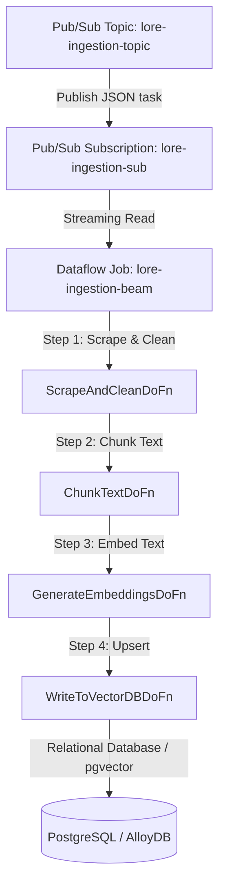

# Lore Ingestion Dataflow Orchestration Design

Migrate the real-time Wiki/Lore scraping ingestion pipeline to run on Google Cloud Dataflow (Apache Beam) as a Flex Template using the Single Docker Image configuration.

## Proposed Architecture

## Key Components

### 1. Dockerfile (`deploy/Dockerfile.dataflow`)
A Single Docker Image container that houses both the launcher and the worker dependencies. It copies the Python template launcher binary, installs system packages (`libpq-dev`, etc.), copies `requirements.txt`, installs BeautifulSoup, copies the backend code, and sets up `PYTHONPATH`.

### 2. Metadata Spec (`deploy/lore_ingestion_metadata.json`)
The Flex Template metadata detailing the command-line parameters of the pipeline:
*   `pubsub_subscription` (Required): Pub/Sub subscription to consume.
*   `database_url` (Optional): Connection string for the relational database.
*   `django_env` (Optional): Environment type (`production` or `development`).

### 3. Pipeline Parameter Propagation (`backend/pipeline/mlops/lore_ingestion_beam.py`)
Modify `lore_ingestion_beam.py` to parse custom arguments (`--database_url`, `--django_env`) and pass them to `GenerateEmbeddingsDoFn` and `WriteToVectorDBDoFn` constructors so that workers can configure Django with database access before importing models.

### 4. Cloud Build Configuration (`deploy/cloudbuild_dataflow.yaml`)
Build, push, and register the template on Artifact Registry and GCS:
*   Docker image registry: `europe-west9-docker.pkg.dev/animetix/animetix-repo/lore-ingestion-beam:latest`
*   Template specification location: `gs://animetix-dataflow/templates/lore-ingestion-beam.json`

## Verification Plan
1.  **Local Unit Tests**: Update local tests in `tests/backend/test_lore_ingestion_beam.py` to cover pipeline options parsing and construction parameter handling.
2.  **Lint Check**: Run static checks to ensure no syntax/import issues exist.
3.  **Deployment Verification**: Proactively build and dry-run template creation if gcloud tool permissions are present, or provide explicit instructions.
