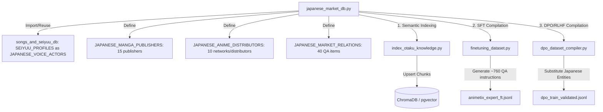

# Japanese Manga/Anime Market Database Integration Design

Integrate Japanese manga publishers, anime distributors, production companies, and TV networks into the training and validation pipeline, mirroring the existing French market database structure.

## Proposed Architecture

## Key Components

### 1. Database File (`backend/pipeline/mlops/japanese_market_db.py`)
Define the Japanese manga and anime ecosystem metadata:
*   **`JAPANESE_VOICE_ACTORS`**: Sourced from `SEIYUU_PROFILES` to avoid duplication.
*   **`JAPANESE_MANGA_PUBLISHERS`**: 15 publishers including *Shueisha*, *Kodansha*, *Shogakukan*, *Kadokawa*, *Square Enix*, *Hakusensha*, *Akita Shoten*, *Futabasha*, *Tokuma Shoten*, *Houbunsha*, *Leed*, *Shodensha*, *Ichijinsha*, *Mag Garden*, and *Media Factory*.
*   **`JAPANESE_ANIME_DISTRIBUTORS`**: 10 companies/TV networks including *Aniplex*, *Toho*, *Toei Animation*, *Bandai Namco Filmworks*, *Pony Canyon*, *Kadokawa*, *TV Tokyo*, *Fuji TV*, *MBS*, and *NHK*.
*   **`JAPANESE_MARKET_RELATIONS`**: 40 handcrafted French QA relations about Japan's publishing history, magazine serializations, TV slot history, and production committees.

### 2. Indexer Integration (`backend/pipeline/mlops/index_otaku_knowledge.py`)
Import the new database variables and append them to the compiled semantic facts under categories:
*   `"Japanese Manga Publishers"`
*   `"Japanese Anime Distributors (JP)"`

### 3. SFT Compiler Integration (`backend/pipeline/mlops/finetuning_dataset.py`)
*   Implement `generate_japanese_market_profile_instructions()`: Generates 15 question variations per actor, publisher, and distributor profile (total 600 samples).
*   Implement `generate_japanese_market_relations_instructions()`: Generates 4 question variations per relational fact (total 160 samples).
*   Integrate both generators in `compile_dataset()` to append the generated instructions to the specialized training partition.

### 4. DPO Compiler Integration (`backend/pipeline/mlops/dpo_dataset_compiler.py`)
*   Import `JAPANESE_MANGA_PUBLISHERS` and `JAPANESE_ANIME_DISTRIBUTORS`.
*   Populate `PUBLISHERS_LIST` and `DISTRIBUTORS_LIST` with the Japanese lists.
*   Update `RELATED_ENTITIES_MAP` to group Japanese entities so that the DPO factual corruption logic replaces them with relevant Japanese choices (e.g. replacing *Shueisha* with *Kodansha*, not *Ki-oon*).

---

## Verification Plan

### Automated Tests
1.  **Local Unit Tests**: Add a unit test in `tests/mlops/test_finetuning_dataset.py` to verify that Japanese profiles and relations are correctly generated and formatted.
2.  **DPO Validation Tests**: Add a test in `tests/mlops/test_dpo_dataset_compiler.py` to verify that Japanese entities are correctly corrupted/substituted without cross-lingual contamination.
3.  **Indexing Tests**: Run the indexer with `--dry-run` to ensure all facts compile without runtime errors.
